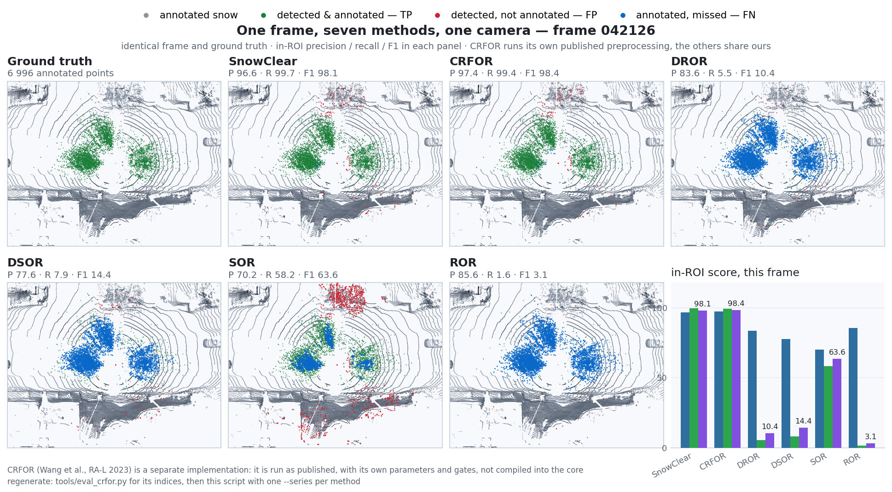
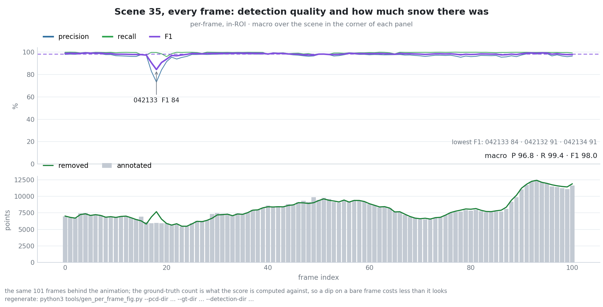
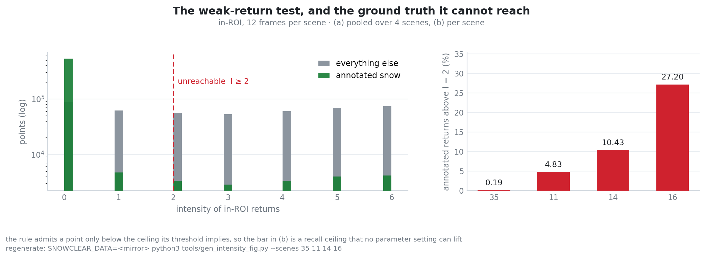
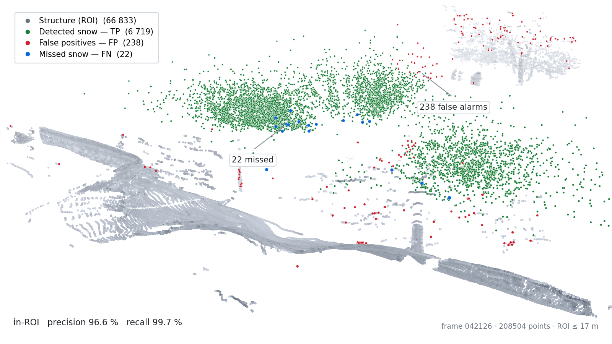
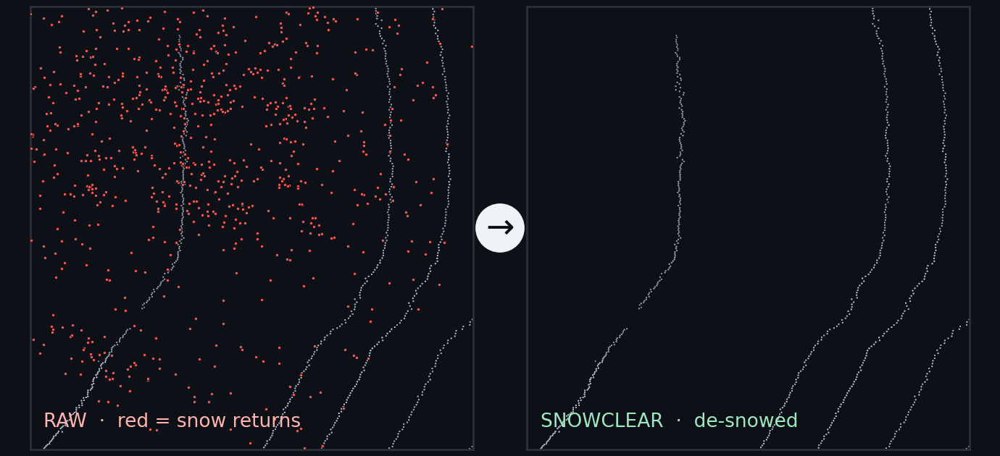

<div align="center">

# SnowClear

**Training-free snow removal for spinning LiDAR via RITS**

<sub><b>R</b>ange–<b>I</b>ntensity <b>T</b>hresholding with zero-intensity <b>S</b>urface suppression &nbsp;·&nbsp; real-time &nbsp;·&nbsp; CPU-only &nbsp;·&nbsp; no learned weights</sub>

[](https://docs.ros.org/en/jazzy/)
[](https://en.cppreference.com/w/cpp/17)
[](https://pointclouds.org/)
[](#quick-start)
[](#reproducibility)
[](LICENSE)

[Quick start](#quick-start) &nbsp;•&nbsp; [Method](#method) &nbsp;•&nbsp; [Results](#results) &nbsp;•&nbsp; [Analysis](#analysis) &nbsp;•&nbsp; [Docs](#documentation)

*English &nbsp;|&nbsp; [中文](README_CN.md)*

</div>


*One scene, 21 consecutive frames, one fixed view — **SnowClear** on top, **ground truth** below.
Each column does one job: **Raw scan** is the input, **Removed** is what came out (ours coloured by
whether the annotation agrees — green it does, red it does not), **De-snowed** is what stayed in
(ours marks what it should have removed in blue). The two rows share the columns, so the comparison
is direct: where our green is short we under-removed, where it is red we over-removed, and a clean
looking de-snowed cloud cannot pass for a correct one.*

**SnowClear removes snowfall noise from a LiDAR scan point by point, at ≈10 ms per frame on CPU,
with no training and no learned weights.** A raw frame goes in; the de-snowed cloud and the snow
indices come out in the index space of the cloud you passed in. The core links only PCL, OpenMP and
TBB — never ROS — so the same library runs offline and as a ROS 2 node, and the two produce
bit-identical output, which two byte-exact gates enforce rather than assume.

| | |
|---|---|
| **Accuracy** — 16 scenes, 1 620 frames | P 96.69 · R 89.98 · **F1 92.82** |
| **Speed** — Release build, CPU only | **≈ 10 ms** per frame, no GPU |
| **Against the best non-learned baseline** | **2.4×** its F1 (SOR 37.93), 9× faster |
| **Learning** | none — no weights, no dataset to download |
| **Output** | snow indices in the input cloud's own index space |

---

## Quick start

| Component | Version |
|---|---|
| OS / ROS | Ubuntu 24.04 (tested) · ROS 2 Jazzy |
| PCL | 1.10+ (`common`, `filters`, `io`, `kdtree`, `search`); `pcl_ros` is **not** needed |
| Toolchain | C++17 (g++ 9+), TBB, OpenMP, Eigen, `yaml-cpp` (CLI only) |

```bash
source /opt/ros/jazzy/setup.bash
git clone https://github.com/p20030920p/SnowClear.git && cd SnowClear
colcon build --cmake-args -DCMAKE_BUILD_TYPE=Release   # -O0 misrepresents runtime ~10x
source install/setup.bash
```

Offline — no ROS graph involved:

```bash
# one frame
ros2 run snowclear_core snowclear_cli pcd_file:=/path/frame.pcd result_folder:=/path/gt

# a folder, writing the snow indices
ros2 run snowclear_core snowclear_cli process_all_frames:=true pcd_folder:=/path/scans \
  result_folder:=/path/gt save_results:=true output_dir:=/tmp/out
```

As a ROS 2 node:

```bash
ros2 launch snowclear_ros snowclear.launch.py rviz:=true
```

| Topic | Type | |
|---|---|---|
| `~/input/points` | `sensor_msgs/PointCloud2` | subscribe |
| `~/output/points` | `sensor_msgs/PointCloud2` | the de-snowed cloud |
| `~/output/snow_points` | `sensor_msgs/PointCloud2` | what was removed |
| `~/output/snow_indices` | `std_msgs/Int32MultiArray` | indices into the input cloud |

Every algorithm parameter is a ROS 2 parameter whose default *is* the released value, so
`ros2 param set /snowclear score_threshold 0.6` takes effect on the next scan and a params file is
only ever an override. Replay a PCD with no sensor: `ros2 run snowclear_ros scan_to_cloud.py
--pcd frame.pcd --rate 1.0`. Details in [`docs/ROS2.md`](docs/ROS2.md).

---

## Method

Each point is tested in this order, and every step only sees what the previous one kept:

1. **ROI gate** — keep `z ∈ [−1.0, 2.6] m`, `r ≤ 17 m`, elevation `≥ −23°`.
2. **Range–intensity score** — a *weak* return scores high: `s = (1 − I/T)^1.2`, against a threshold
   `T(r, I)` that a Gamma-shaped weight pulls down where beam density peaks.
3. **Zero-intensity surface veto** — a zero return within 0.6 m of a bright point, 7 m out, is a
   surface artefact and not snow.
4. **Fused decision** — `C = 0.7·s + 0.15·h_ag`, accepted above `θ`; the height term is capped at
   0.15 so geometry can never outvote intensity.


*Algorithm 1 — the whole detector, 25 lines. Derivation, disabled features and the exact constants:
[`docs/METHOD.md`](docs/METHOD.md).*

---

## Results

Release build, `OMP_NUM_THREADS=2`, I/O and evaluation excluded from the timing; macro average over
scenes on 16 scenes / 1 620 frames of [WADS](https://digitalcommons.mtu.edu/wads/). Every figure is
regenerated by a tool in this repository — commands in
[`docs/figures/README.md`](docs/figures/README.md).


*SnowClear's F1 is **2.4×** the best filter's, and the ordering is not close: the density filters look
precise only because they return almost nothing — under 4 % recall.*

| Method | Precision | Recall | F1 | ms / frame |
|---|---:|---:|---:|---:|
| DROR (Charron et al., CRV 2018) | 85.54 | 3.57 | 6.80 | 1041 |
| DSOR (Kurup & Bos, 2021) | 85.02 | 3.88 | 7.36 | 70 |
| SOR (Rusu et al., 2008) | 89.24 | 25.56 | 37.93 | 110 |
| ROR (Rusu, 2009) | 79.70 | 0.89 | 1.76 | 1013 |
| **SnowClear (RITS)** | **96.69** | **89.97** | **92.82** | **≈ 10** |

Reproduce the table with `bash tools/eval_baselines.sh <outdir>`.

### The same frame, five detectors



*The failure modes are opposite and both fatal: DROR / DSOR / ROR never touch the annotated snow
(blue), SOR takes the road surface with it (red). SnowClear is the only panel that matches the
ground truth.*


*In bird's-eye view the removed layer reads as a thin film over the road rather than a cloud — which
is what snow on a LiDAR actually is.*

### Portability


*A +0.9 m mount costs the released constants **24.25 pp** of F1 and the label-free self-calibration
0.06 pp. What breaks is recall — 89.97 → 53.42 % — while precision holds: the constants stop covering
the same part of the world.*

### Where the recall goes


*89.90 % of ground truth stays reachable and the measured recall is 89.98 %, so the remaining loss is
the gate and the intensity ceiling, **not** the decision rule.*

---

## Analysis

The measurements behind those numbers, in the order a reader usually asks about them.

### Frame by frame, not just on average



*F1 is 98.0 across all 101 frames and the detector removes about as many points as are annotated,
which is what says it is not trading recall for precision. The three dips are thin-snow frames, where
a handful of points moves a percentage.*

### Why a weak-return test, and what it can never reach



*On scene 35, 99.6 % of annotated returns are exactly `I = 0` while 98 % of everything else is
brighter — that is why a weak-return rule is the right shape here. The ceiling is not uniform though:
it hides 0.19 % of the annotations on scene 35 and **27.20 %** on scene 16, which is precisely why
scene 16 is the recall-limited one.*

### What the residual error looks like


*The detection tracks the annotation closely; what is left over sits in a few clusters just inside the
ROI, which is where the gate and the height term compete.*


*The other end of the range (recall 44 %): the misses are mostly annotated points **outside** the ROI,
unreachable by construction rather than by decision.*

### Before and after


*One caption for the pair, because it is one view: 6 957 of 208 504 points removed on this frame,
spread as a film over the road rather than as clusters.*

### The same frame in 3D



*The snow sits **above** the ground surface, which is why the height term helps at the margin — and
why geometry alone cannot carry the decision.*



*The same pair as a single card, for slides or print.*

### Per scene, ablation, time, and the gate in closed form


*Two scenes fall outside the reported band, and they are the same two that carry the largest
unreachable share above — the weakness is systematic, not noise.*


*Every module that ships disabled costs F1 when enabled, and the grid-search optimiser buys
+0.0012 pp while tripling the frame time — which is why it returns the defaults.*


*Preprocessing 2.05 ms, feature analysis with the optimiser 4.01 ms, filtering 3.28 ms. The `α(r)` LUT
is worth a paired +1.53 ms; the elevation fast path's saving is below what these timers resolve.*


*The gate in closed form: the ceiling lands in the empty gap between the two intensity spikes, which
is why moving the threshold across its whole range changes almost nothing.*


*`T(r, I)`, the `α(r)` weight that shapes it, and a base threshold pinned at its floor in 69.7 % of
frames.*

---

## Reproducibility

```bash
SNOWCLEAR_DATA=/path/to/wads-mirror bash tools/verify.sh   # clean build + all gates
```

Three gates, all cheap: unit tests (`colcon test`), the offline byte-exact gate
(`snowclear_runner --mode all_checks`, reproduces the released reference output byte for byte) and
the live byte-exact gate (`src/snowclear_ros/test/live_check.py`, proves the ROS 2 path emits the
same indices). Any change that can alter detection must turn the second one red. Data layout and
ground-truth format: [`docs/DATASET.md`](docs/DATASET.md).

---

## Documentation

Method and shipped constants [`docs/METHOD.md`](docs/METHOD.md) &nbsp;·&nbsp; node reference
[`docs/ROS2.md`](docs/ROS2.md) &nbsp;·&nbsp; package split
[`docs/ARCHITECTURE.md`](docs/ARCHITECTURE.md) &nbsp;·&nbsp; measurements, ablations and the
prioritised roadmap [`docs/OPTIMIZATION.md`](docs/OPTIMIZATION.md) &nbsp;·&nbsp; figure index
[`docs/figures/README.md`](docs/figures/README.md) &nbsp;·&nbsp; ROS 1 differences
[`docs/MIGRATION_ROS1.md`](docs/MIGRATION_ROS1.md).

## Citation

```bibtex
@article{snowclear,
  title   = {SnowClear: Training-Free Snow-Point Detection and Removal for Spinning LiDAR
             via Range--Intensity Thresholding and Zero-Intensity Surface Suppression},
  author  = {TODO: authors},
  journal = {TODO: venue},
  year    = {TODO: year},
  url     = {https://github.com/p20030920p/SnowClear}
}
```

## License

Not yet chosen — see [`LICENSE`](LICENSE). Third-party material keeps its upstream terms: the
non-learned baselines in `dynamic_outlier_filters.cpp` follow
[DROR](https://github.com/nickcharron/lidar_snow_removal) (Charron et al., CRV 2018) and
[DSOR](https://github.com/assasinXL/dsor_filter) (Kurup & Bos, 2021).

## Contact

Questions, bugs and reproduction failures: please open an issue — include the output of
`--mode all_checks` and your `OMP_NUM_THREADS`.
