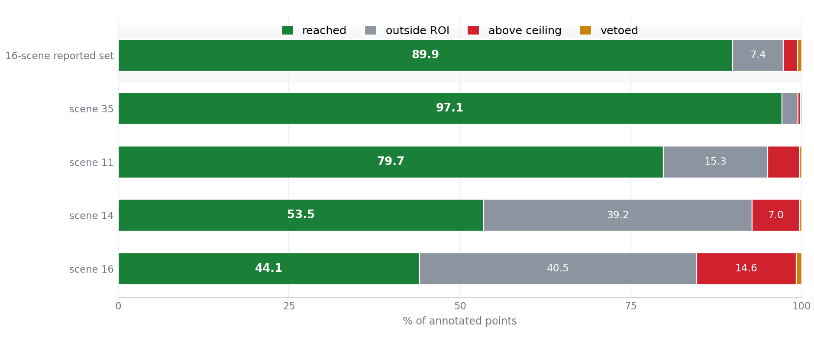

<div align="center">

# SnowClear

**Training-free snow removal for spinning LiDAR via RITS**

<sub><b>R</b>ange–<b>I</b>ntensity <b>T</b>hresholding with zero-intensity <b>S</b>urface suppression &nbsp;·&nbsp; real-time &nbsp;·&nbsp; CPU-only &nbsp;·&nbsp; no learned weights</sub>

[](https://docs.ros.org/en/jazzy/)
[](https://en.cppreference.com/w/cpp/17)
[](https://pointclouds.org/)
[](#quick-start)
[](#reproducibility)
[](LICENSE)

[Quick start](#quick-start) &nbsp;•&nbsp; [Method](#method) &nbsp;•&nbsp; [Results](#results) &nbsp;•&nbsp; [Analysis](#analysis) &nbsp;•&nbsp; [Docs](#documentation)

*English &nbsp;|&nbsp; [中文](README_CN.md)*

</div>


*Scene 35, 21 frames. Top: SnowClear. Bottom: ground truth. Columns: raw scan, removed, de-snowed.
Green: removed and annotated. Red: removed, not annotated. Blue: annotated, kept.*

**Point-wise snow removal for spinning LiDAR: ≈10 ms per frame on CPU, no training, no learned
weights.** In: one raw frame. Out: the de-snowed cloud and the snow indices, in the input cloud's own
index space. The core links PCL, OpenMP and TBB only, never ROS, so the offline and ROS 2 paths give
identical output. Two byte-exact gates check that.

| | |
|---|---|
| **Accuracy** — 16 scenes, 1 620 frames | P 96.69 · R 89.98 · **F1 92.82** |
| **Speed** — Release build, CPU only | **≈ 10 ms** per frame, no GPU |
| **Against the best non-learned baseline** | **2.4×** its F1 (SOR 37.93), 9× faster |
| **Learning** | none — no weights, no dataset to download |
| **Output** | snow indices in the input cloud's own index space |

---

## Quick start

| Component | Version |
|---|---|
| OS / ROS | Ubuntu 24.04 (tested) · ROS 2 Jazzy |
| PCL | 1.10+ (`common`, `filters`, `io`, `kdtree`, `search`); `pcl_ros` is **not** needed |
| Toolchain | C++17 (g++ 9+), TBB, OpenMP, Eigen, `yaml-cpp` (CLI only) |

```bash
source /opt/ros/jazzy/setup.bash
git clone https://github.com/p20030920p/SnowClear.git && cd SnowClear
colcon build --cmake-args -DCMAKE_BUILD_TYPE=Release   # -O0 misrepresents runtime ~10x
source install/setup.bash
```

Offline — no ROS graph involved:

```bash
# one frame
ros2 run snowclear_core snowclear_cli pcd_file:=/path/frame.pcd result_folder:=/path/gt

# a folder, writing the snow indices
ros2 run snowclear_core snowclear_cli process_all_frames:=true pcd_folder:=/path/scans \
  result_folder:=/path/gt save_results:=true output_dir:=/tmp/out
```

As a ROS 2 node:

```bash
ros2 launch snowclear_ros snowclear.launch.py rviz:=true
```

| Topic | Type | |
|---|---|---|
| `~/input/points` | `sensor_msgs/PointCloud2` | subscribe |
| `~/output/points` | `sensor_msgs/PointCloud2` | the de-snowed cloud |
| `~/output/snow_points` | `sensor_msgs/PointCloud2` | what was removed |
| `~/output/snow_indices` | `std_msgs/Int32MultiArray` | indices into the input cloud |

All algorithm parameters are ROS 2 parameters whose defaults are the released values;
`ros2 param set /snowclear score_threshold 0.6` applies to the next scan. Replay a PCD without a
sensor: `ros2 run snowclear_ros scan_to_cloud.py --pcd frame.pcd --rate 1.0`. Node reference:
[`docs/ROS2.md`](docs/ROS2.md).

---

## Method

Four tests per point, in this order; each sees only what the previous one kept:

1. **ROI gate** — `z ∈ [−1.0, 2.6] m`, `r ≤ 17 m`, elevation `≥ −23°`.
2. **Range–intensity score** — weak returns score high: `s = (1 − I/T)^1.2`, with `T(r, I)` pulled down
   by a Gamma-shaped weight where beam density peaks.
3. **Surface veto** — a zero return within 0.6 m of a bright point beyond 7 m is rejected.
4. **Decision** — `C = 0.7·s + 0.15·h_ag` above `θ`; the height term is capped at 0.15.


*Algorithm 1 — the whole detector, 25 lines. Derivation, disabled features and the exact constants:
[`docs/METHOD.md`](docs/METHOD.md).*

---

## Results

Release build, `OMP_NUM_THREADS=2`; timing excludes I/O and evaluation. Reproduction commands:
[`docs/figures/README.md`](docs/figures/README.md).


*Frame `042126`, same ground truth for every panel; the scoreboard repeats each method's in-ROI
P / R / F1. CRFOR (Wang et al., RA-L 2023) is run as published, with its own preprocessing and
parameters; the four filters share ours.*

### Scene 35 — every method on the same 101 frames

| Method | Precision | Recall | F1 | ms / frame |
|---|---:|---:|---:|---:|
| **SnowClear** | **96.79** | **97.07** | **96.90** | **≈ 9** |
| CRFOR (Wang et al., RA-L 2023) | 95.95 | 96.92 | 96.41 | 17 132 |
| DROR (Charron et al., CRV 2018) | 82.45 | 6.76 | 12.48 | 1041 |
| DSOR (Kurup & Bos, 2021) | 81.58 | 6.93 | 12.73 | 70 |
| SOR (Rusu et al., 2008) | 82.87 | 44.28 | 56.68 | 110 |
| ROR (Rusu, 2009) | 77.13 | 1.86 | 3.63 | 1013 |

CRFOR's numbers come from its own repository via `tools/eval_crfor.py`; the others from
`bash tools/eval_baselines.sh` with `SCENES=35`. Latency column: the idle single-scene run, so it
does not inherit the load the accuracy runs happened to see.

### The 16-scene reported set — SnowClear against the four built-in filters

| Method | Precision | Recall | F1 | ms / frame |
|---|---:|---:|---:|---:|
| DROR (Charron et al., CRV 2018) | 85.54 | 3.57 | 6.80 | 1041 |
| DSOR (Kurup & Bos, 2021) | 85.02 | 3.88 | 7.36 | 70 |
| SOR (Rusu et al., 2008) | 89.24 | 25.56 | 37.93 | 110 |
| ROR (Rusu, 2009) | 79.70 | 0.89 | 1.76 | 1013 |
| **SnowClear (RITS)** | **96.69** | **89.97** | **92.82** | **≈ 10** |

CRFOR is not in this table: at ~17 s per frame a 1 620-frame run is a
multi-hour job, and its scene-35 result above is the honest sample we have.



*Ground-truth budget, released configuration: each annotated point charged to the first stage that
rejects it. The green share is the recall ceiling — 89.90 % on the reported set against a measured
recall of 89.98 % — and on scene 16 the ROI gate takes 40.5 % with the intensity ceiling at 14.6 %.*

More figures — per-scene detail, ablation, frame time, the gate in closed form, frame-by-frame
traces, the intensity distribution: [`docs/figures/README.md`](docs/figures/README.md).

---

## Reproducibility

```bash
SNOWCLEAR_DATA=/path/to/wads-mirror bash tools/verify.sh   # clean build + all gates
```

Three gates: unit tests (`colcon test`), the offline byte-exact gate (`--mode all_checks`,
reproduces the released reference output byte for byte) and the live byte-exact gate
(`src/snowclear_ros/test/live_check.py`). A change that can alter detection turns the second one red.
Data layout: [`docs/DATASET.md`](docs/DATASET.md).

---

## Documentation

Method and shipped constants [`docs/METHOD.md`](docs/METHOD.md) &nbsp;·&nbsp; node reference
[`docs/ROS2.md`](docs/ROS2.md) &nbsp;·&nbsp; package split
[`docs/ARCHITECTURE.md`](docs/ARCHITECTURE.md) &nbsp;·&nbsp; measurements, ablations and the
prioritised roadmap [`docs/OPTIMIZATION.md`](docs/OPTIMIZATION.md) &nbsp;·&nbsp; figure index
[`docs/figures/README.md`](docs/figures/README.md) &nbsp;·&nbsp; ROS 1 differences
[`docs/MIGRATION_ROS1.md`](docs/MIGRATION_ROS1.md).

## Citation

```bibtex
@article{snowclear,
  title   = {SnowClear: Training-Free Snow-Point Detection and Removal for Spinning LiDAR
             via Range--Intensity Thresholding and Zero-Intensity Surface Suppression},
  author  = {TODO: authors},
  journal = {TODO: venue},
  year    = {TODO: year},
  url     = {https://github.com/p20030920p/SnowClear}
}
```

## License

Not yet chosen — see [`LICENSE`](LICENSE). Third-party material keeps its upstream terms: the
non-learned baselines in `dynamic_outlier_filters.cpp` follow
[DROR](https://github.com/nickcharron/lidar_snow_removal) (Charron et al., CRV 2018) and
[DSOR](https://github.com/assasinXL/dsor_filter) (Kurup & Bos, 2021).

## Contact

Questions, bugs and reproduction failures: please open an issue — include the output of
`--mode all_checks` and your `OMP_NUM_THREADS`.
