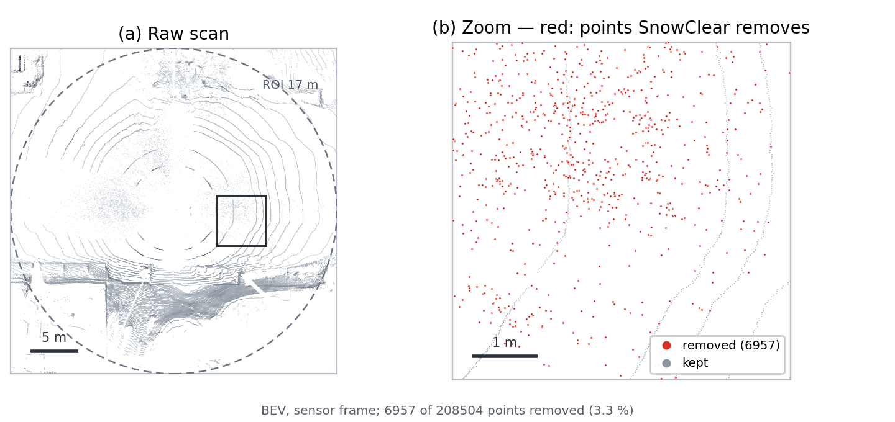
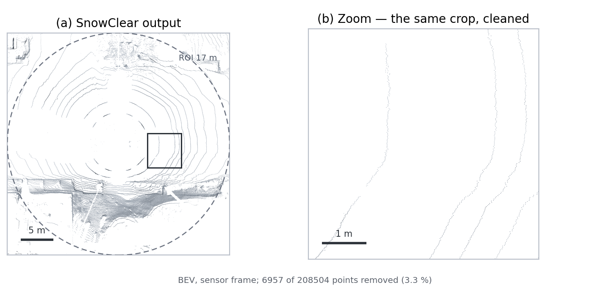
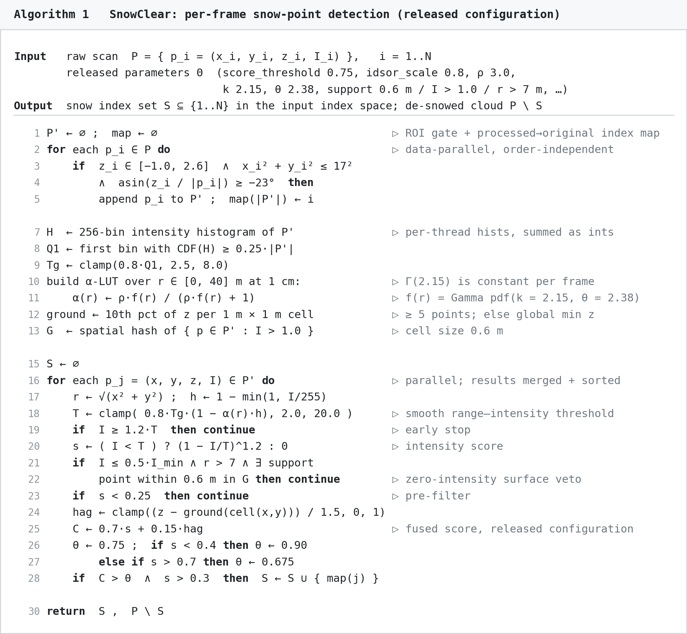
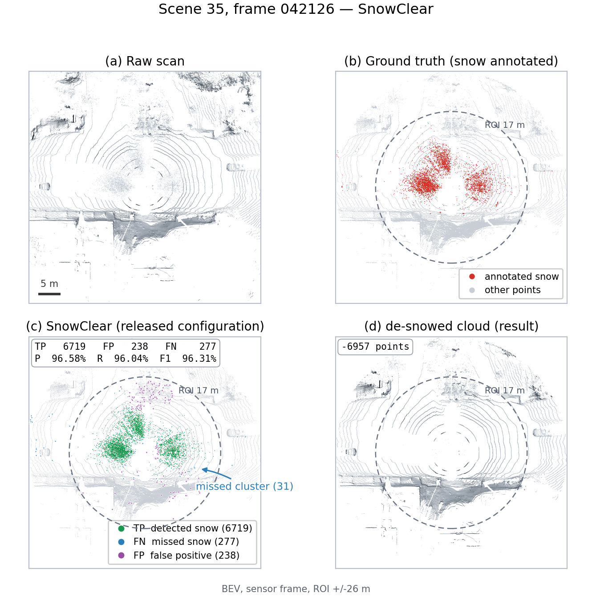
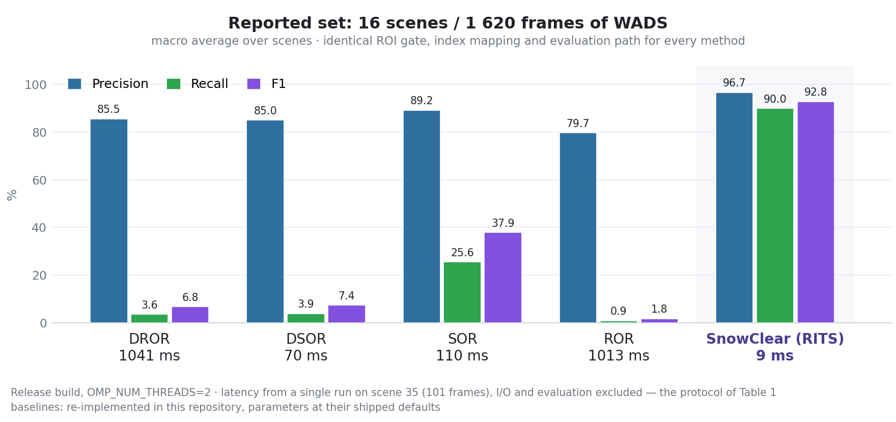
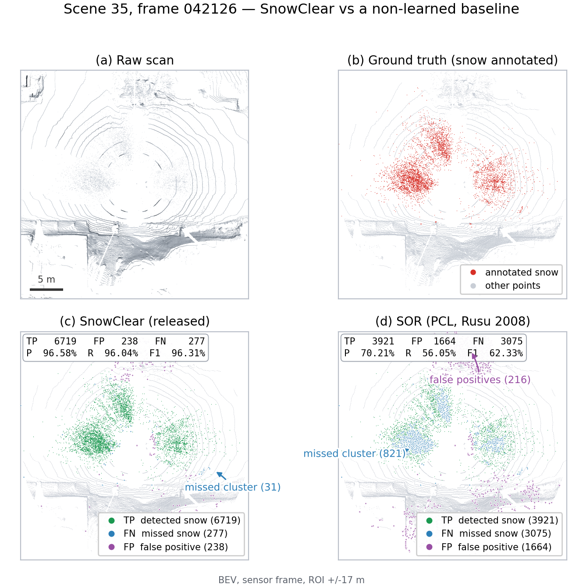
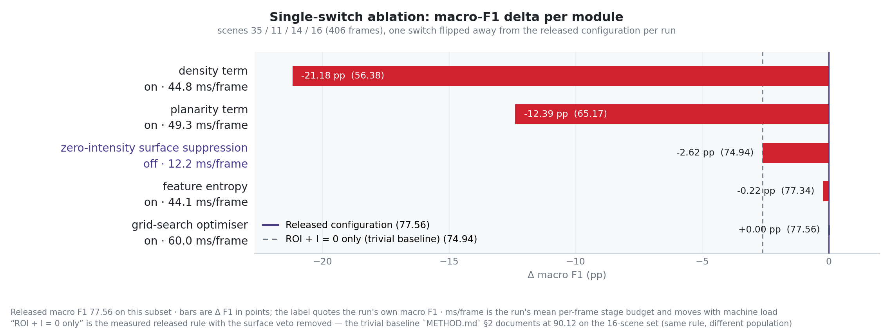
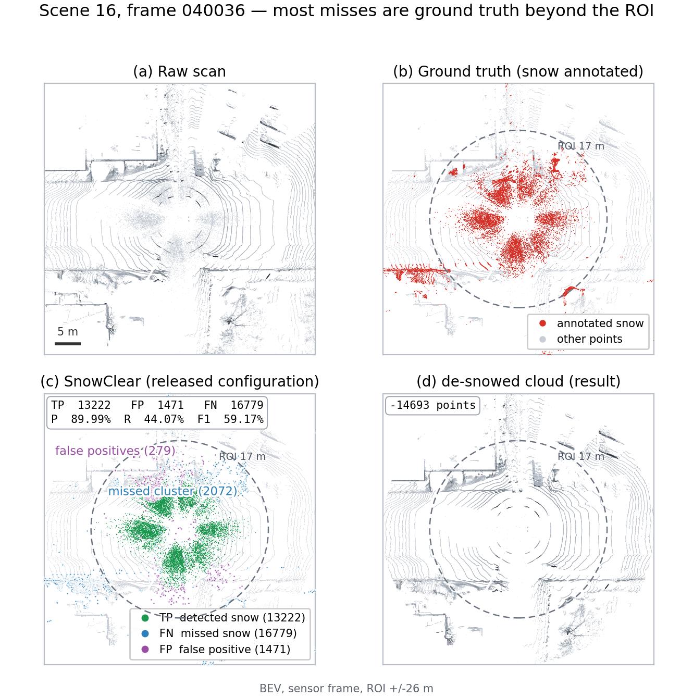

<div align="center">

# SnowClear: Training-Free Snow-Point Detection and Removal for Spinning LiDAR via Range–Intensity Thresholding and Zero-Intensity Surface Suppression

**Real-time, training-free snow-point detection and removal for LiDAR point clouds — with a ROS-agnostic algorithm core**

[](https://docs.ros.org/en/jazzy/)
[](https://en.cppreference.com/w/cpp/17)
[](https://pointclouds.org/)
[](#requirements)
[](#reproducibility)
[](LICENSE)

[Method](#method) &nbsp;•&nbsp; [Results](#results) &nbsp;•&nbsp; [Reproducibility](#reproducibility) &nbsp;•&nbsp; [Quick start](#quick-start) &nbsp;•&nbsp; [ROS 2 usage](#ros-2-usage) &nbsp;•&nbsp; [Citation](#citation)

*English &nbsp;|&nbsp; [中文](README_CN.md)*

</div>

## Before / after



*Fig. A — **Before.** The raw scan, 208 504 points. Red marks the 6 957 points SnowClear
classifies as snow — 3.3 % of the frame, concentrated in the scan rings. The right panel zooms
5.2 m onto those rings; 1 m scale bar.*



*Fig. B — **After.** The de-snowed cloud, same region. Ring structure, road surface and
buildings are untouched. The full panels carry a 5 m bar and the dashed 17 m ROI circle;
regenerate both with `python3 tools/render_hero.py`.*

---

## Summary

SnowClear removes snowfall-induced noise from mechanical spinning LiDAR scans **per point**,
at frame rate, on CPU, with **no training, no GPU and no learned weights**. Given a point
cloud it returns the de-snowed cloud and the indices of the points classified as snow, in the
coordinate frame and index space of the *original* input.

The method combines three ingredients: a **smooth range–intensity threshold** whose
distance dependence is a Gamma-shaped fit to the weather-particle range distribution, a
**per-point intensity score** fused with a normalised height-above-ground term, and a
**zero-intensity surface veto** that rejects points sitting on a bright surface — the dominant
false-positive source. Every stage is deterministic and parallel-safe, so the detection set
does not depend on the thread count.

The design constraint that shapes this repository: **the algorithm must not depend on a
middleware**. The detection code links only PCL, OpenMP and TBB, so the same library is
driven by a ROS 2 node, by an offline CLI, and by unit tests — and all three are proven to
produce identical output.

> **Reproducibility first.** The repository ships the released parameter set and a reference
> detection output. Two independent gates verify a rebuild: an offline byte-exact regression
> and a live publish/subscribe check that asserts the ROS 2 path emits the *same* 6 957
> indices. Neither is optional in CI.

---

## Highlights

- **Middleware-free core.** `snowclear_core` never links `rclcpp`. The ROS 2 layer is a thin
  adapter, so an embedded or offline deployment does not pay for ROS.
- **Live and offline agree bit-for-bit.** The node calls the same
  `CloudOperations::process_cloud()` the CLI does, and `live_check.py` proves it on real data.
- **No learning, no GPU.** ~10 ms per frame on the reference machine, CPU only, Release build.
- **Byte-exact regression.** One command fails the build if a refactor moves a single index.
- **Typed ROS 2 parameters.** Every algorithm parameter is declared from a generated
  registry, so `ros2 param list` shows the complete tunable surface — and
  `tools/gen_param_map.py --check` fails if a parameter is added without registering it.
- **Honest evaluation protocol.** Zero-detection frames, empty ground truth, whole-frame true
  negatives and 0/0 denominators are handled explicitly instead of inflating scores.
- **Non-learned baselines included.** DROR and DSOR share the exact preprocessing and
  evaluation path as the proposed method.

---

## Method

### Algorithm 1 — per-frame detection

The pipeline below **is** the released configuration, not an idealised version of it: the
switches that are off, and what the fused score collapses to as a result, are stated in
[§ What the released configuration computes](#what-the-released-configuration-actually-computes).



*Fig. 0 — Algorithm 1 as shipped. Regenerate with `python3 tools/gen_algorithm_fig.py`
(PNG + SVG, EN + ZH) rather than editing the image.*

<details>
<summary>Plain-text source of Algorithm 1 (for copying into a paper or a slide)</summary>

```text
Algorithm 1  SnowClear: per-frame snow-point detection (released configuration)
────────────────────────────────────────────────────────────────────────────────────────
Input   raw scan  P = { p_i = (x_i, y_i, z_i, I_i) },  i = 1..N
        released parameters Θ  (score_threshold 0.75, idsor_scale 0.8, ρ 3.0,
                                k 2.15, θ 2.38, support 0.6 m / I>1.0 / r>7 m, …)
Output  snow index set  S ⊆ {1..N} in the *input* index space; de-snowed cloud P \ S

 1  P' ← ∅ ;  map ← ∅                              ▷ ROI gate + processed→original index map
 2  for each p_i ∈ P do                            ▷ data-parallel, order-independent
 3      if  z_i ∈ [−1.0, 2.6]  ∧  x_i² + y_i² ≤ 17²
 4          ∧  asin(z_i / ‖p_i‖) ≥ −23°  then
 5          append p_i to P' ;  map(|P'|) ← i
 6
 7  H  ← 256-bin intensity histogram of P'         ▷ per-thread histograms, summed as integers
 8  Q1 ← first bin with CDF(H) ≥ 0.25·|P'|
 9  Tg ← clamp(0.8·Q1, 2.5, 8.0)
10  build α-LUT over r ∈ [0, 40] m at 1 cm:        ▷ Γ(2.15) is constant per frame → hoisted
11      α(r) ← ρ·f(r) / (ρ·f(r) + 1),   f(r) = Gamma_pdf(r; k = 2.15, θ = 2.38)
12  ground ← 10th percentile of z per 1 m × 1 m cell (≥ 5 points; else global min z)
13  G  ← spatial hash of support points { p ∈ P' : I > 1.0 }, cell size 0.6 m
14
15  S ← ∅
16  for each p_j = (x, y, z, I) ∈ P' do            ▷ data-parallel; per-thread results sorted
17      r ← √(x² + y²) ;   h ← 1 − min(1, I/255)
18      T ← clamp( 0.8 · Tg · (1 − α(r)·h), 2.0, 20.0 )      ▷ smooth range–intensity threshold
19      if  I ≥ 1.2·T  then continue                          ▷ early stop
20      s ← ( I < T ) ? (1 − I/T)^1.2 : 0                     ▷ intensity score
21      if  I ≤ 0.5·I_min  ∧  r > 7  ∧  ∃ support point within 0.6 m of p_j in G
22          then continue                                     ▷ zero-intensity surface veto
23      if  s < 0.25  then continue                           ▷ pre-filter
24      hag ← clamp( (z − ground(cell(x, y))) / 1.5, 0, 1 )   ▷ height above local ground
25      C ← 0.7·s + 0.15·hag                                  ▷ fused score, released configuration
26      θ ← 0.75 ;  if s < 0.4 then θ ← 0.90 else if s > 0.7 then θ ← 0.675
27      if  C > θ  ∧  s > 0.3  then  S ← S ∪ { map(j) }
28
29  return  S ,  P \ S
```

</details>

Two implementation notes that the algorithm hides:

- **Determinism under parallelism.** The per-point loop (lines 16–27) is the only
  parallelised part of the decision; each thread accumulates its own index list and the
  lists are concatenated, sorted and de-duplicated. Integer histogram accumulation (line 7)
  makes the scene statistics thread-count-independent too. A unit test asserts that the
  serial and OpenMP paths return the same set bit for bit.
- **Index space.** The detector only ever sees `P'`. Indices are mapped back to the input at
  line 27, so a caller can index its own cloud; the mapping also carries exact-duplicate
  group expansion for the (disabled by default) de-duplication path.

### What the released configuration actually computes

> [!IMPORTANT]
> Several features the accompanying paper describes are **switched off** in the released
> configuration, and the fused score has consequently collapsed to two terms:
>
> - `weight_sum` is `0.35 + 0.15 = 0.50`, so line 25 evaluates to `0.7·s + 0.15·hag`. The
>   height term can contribute **at most 0.15** against a threshold of 0.675–0.90.
> - One consequence: **no point with `I ≥ 2` can ever be classified as snow** under these
>   parameters, because detection requires `s > 0.75`, i.e. `I/T < 0.2132`, and `T ≤ 6.4` in
>   every frame. Two of the three evaluation scenes outside the reported set are
>   recall-limited by exactly this bound.
> - The parameter optimiser is a **no-op**: both optimisation switches are off, so
>   `ParameterOptimizer::optimize()` returns the defaults immediately (measured cost:
>   0.0001 ms per frame). Grid search, feature-based recommendation, planarity, density,
>   entropy, height consistency, isolated-point handling and pre-downsampling are all
>   disabled.
>
> [`docs/METHOD.md`](docs/METHOD.md) writes the decision function down as shipped, with the
> measurements behind each disabled switch. Read it before tuning a parameter, and before
> citing a module the released configuration never enables.

### The middleware-free seam

Two `ament` packages, split by dependency rather than by convenience:

```text
src/snowclear_core/     the algorithm.  PCL + OpenMP + TBB.  NO ROS.
                        + offline CLI and experiment runner, + unit tests
src/snowclear_ros/      the ROS 2 layer.  No algorithm.
                        + launch, config, RViz, PCD replay, node wiring tests
```

Only two things cross the boundary, and neither has a ROS type in its signature:

| Interface | Purpose | Implementations |
|---|---|---|
| `snowclear::ParamSource` | where configuration comes from | `RosParamSource` (rclcpp), `MapParamSource` (YAML + CLI) |
| `snowclear::set_log_sink()` | where diagnostics go | stdout/stderr by default, `RCLCPP_*` in the node |

Everything numeric lives below that seam. That is why the offline and live paths cannot
drift: they are the same code, differing only in where a string comes from and where a line
of log output goes. Package layout, the threading model and the generated-artefact design are
in [`docs/ARCHITECTURE.md`](docs/ARCHITECTURE.md).

---

## Results

**Conditions.** Release build, `OMP_NUM_THREADS=2`, `OMP_DYNAMIC=false`, I/O and evaluation
excluded from the per-frame time. Ground truth is a per-frame list of snow-point indices.
The evaluation set is 16 scenes / 1 620 frames of the
[Winter Adverse Driving dataSet (WADS)][wads]; point clouds are not redistributable and are
not shipped — see [`docs/DATASET.md`](docs/DATASET.md).

[wads]: https://digitalcommons.mtu.edu/wads/

### Table 1 — Detection quality and latency on the reported set

| Protocol | Precision | Recall | F1 | ms / frame |
|---|---:|---:|---:|---:|
| **Macro average — 16 scenes, 1 620 frames** | **96.6934** | **89.9765** | **92.8229** | **≈ 10** |
| F1 recomputed from the mean P / R | — | — | 93.2141 | — |
| Pooled over 1 620 frames | 96.8927 | 88.7047 | 92.6181 | — |

<!-- Fig. 1 — drop docs/figures/fig1_per_scene.png in, then uncomment:

-->
*Fig. 1 — Per-scene precision / recall / F1 across the 19 mirrored scenes, with the 16-scene
reported set marked. Slot: `docs/figures/fig1_per_scene.png`.*



*Fig. 2 — Reference frame `042126` (scene 35) in four panels: (a) the raw scan, (b) the
annotated snow, (c) the detection split into TP / FN / FP with the per-frame P / R / F1 called
out in the panel and leader lines at the densest error clusters, and (d) the de-snowed cloud
with 6 957 points removed. Ground truth outside the dashed ROI circle is unreachable by
construction. Regenerate with `python3 tools/render_qualitative.py` — see
[`figures/README.md`](docs/figures/README.md).*

### Table 2 — Comparison with non-learned baselines

The baselines are compiled into the core and share the identical ROI gate, index mapping and
evaluation path, so the comparison isolates the decision rule rather than the plumbing.

| Method | Precision | Recall | F1 | ms / frame |
|---|---:|---:|---:|---:|
| DROR (Charron et al., CRV 2018) | TODO | TODO | TODO | TODO |
| DSOR (Kurup & Bos, 2021) | TODO | TODO | TODO | TODO |
| SOR (Rusu et al., 2008) | TODO | TODO | TODO | TODO |
| ROR (Rusu, 2009) | TODO | TODO | TODO | TODO |
| **SnowClear (released configuration)** | **96.6934** | **89.9765** | **92.8229** | **≈ 10** |

<!-- Fig. 3 — drop docs/figures/fig3_comparison.png in, then uncomment:

-->
*Fig. 3 — Precision / recall / F1 of SnowClear against the non-learned baselines of Table 2.
Slot: `docs/figures/fig3_comparison.png`.*

> [!NOTE]
> The `TODO` cells are deliberate: the paper's baseline numbers come from third-party
> upstream harnesses that are not redistributed here, and this repository does not publish
> numbers it cannot reproduce. Run the baselines with
> `detector_type:=dror|dsor|sor|ror` through `snowclear_runner --mode eval_folders` to fill
> them in. A 4-scene subset run with this repository's own re-implementations is in
> [`OPTIMIZATION.md`](docs/OPTIMIZATION.md) §7: SnowClear 77.56 macro F1 against DROR 7.10,
> DSOR 6.93, SOR 36.36 and ROR 1.92.



*Fig. 11 — The same frame, SnowClear (left) against SOR (right) on the identical pipeline.
SOR's panel is dominated by false positives (purple) and misses (blue); F1 96.31 against 62.33.
A qualitative companion to Table 2 — regenerate with `--detection2`.*

### Table 3 — Ablation

| Configuration | Macro F1 | Δ F1 | Source |
|---|---:|---:|---|
| **Released configuration (full)** | **92.8229** | — | Table 1 |
| w/o zero-intensity surface suppression | TODO | **≈ −2.2 pp** | measured *delta*, [`METHOD.md`](docs/METHOD.md) §4 |
| ROI gate + `I = 0` only (no threshold, no score, no height term) | 90.12 | −2.70 pp (derived) | measured, [`METHOD.md`](docs/METHOD.md) §2 |
| + planarity term (`enable_planarity_calculation`) | TODO | ≈ 0 | measured ≈ 0 on 100 frames, [`METHOD.md`](docs/METHOD.md) §5 |
| + density term (`enable_density_calculation`) | TODO | negative | [`METHOD.md`](docs/METHOD.md) §5 |
| + feature entropy (`enable_feature_entropy`) | TODO | negative | [`METHOD.md`](docs/METHOD.md) §5 |
| + grid-search optimisation (first 3 frames) | 92.8229 | 0 | no additional gain; optimiser is a no-op |
| + sensor-height-derived ROI (`enable_sensor_height_roi`) | TODO | changes numerics | default off by design, [`METHOD.md`](docs/METHOD.md) §6 |

Measured single-switch ablation on the 4-scene subset, including the two disabled terms above:
[`OPTIMIZATION.md`](docs/OPTIMIZATION.md) §6 (planarity −12.4 pp, density −21.2 pp, entropy
−0.2 pp, surface suppression −2.6 pp).

<!-- Fig. 4 — drop docs/figures/fig4_ablation.png in, then uncomment:

-->
*Fig. 4 — Module-wise ablation: macro-F1 delta for each switch, with the ROI-plus-`I=0`
trivial baseline drawn as the reference line. Slot: `docs/figures/fig4_ablation.png`.*

<!-- Fig. 5 — drop docs/figures/fig5_acceptance.png in, then uncomment:

-->
*Fig. 5 — Acceptance region of the released decision function in the `(I/T, h_ag)` plane,
showing the `s > 0.75` requirement and the resulting `I < 1.36` ceiling. Slot:
`docs/figures/fig5_acceptance.png`.*

### Table 4 — The three evaluation scenes outside the reported set

They are reported separately rather than dropped, because they bound where the method is
weak (see [`docs/DATASET.md`](docs/DATASET.md) §3).

| Scene | Frames | Precision | Recall | F1 |
|---|---:|---:|---:|---:|
| 14 | 101 | 93.96 | 53.47 | 67.34 |
| 16 | 102 | 95.82 | 44.13 | 59.74 |
| 76 | 5 | 97.85 | 98.84 | 98.34 |
| All 19 scenes, macro average | 1 828 | 96.5654 | 85.4256 | 90.0295 |

Scenes 14 and 16 are **recall-limited** by the intensity ceiling of the released decision
function, not by over-detection: precision stays at 94–96 % while recall halves.

### Table 5 — Where the frame time goes

Measured on scene 35 (101 frames, `OMP_NUM_THREADS=2`), per frame:

| Stage (per frame) | ms | Source / note |
|---|---:|---|
| Ground-truth load + parse | 0.57 | charged to I/O, not to algorithm time |
| Scene statistics + feature analysis (lines 7–13) | 4.18 | histogram, ground grid, support hash |
| Parameter optimisation (line 22) | **0.0001** | returns the defaults immediately |
| `α(r)` threshold LUT, replacing per-point `tgamma`/`pow` | 1.140 → 0.179 | 1 cm table, 4 001 entries, built once per frame |
| Elevation gate, fast path replacing `asin` per point | 1.816 → 1.166 | −36 % on the pre-ROI cloud, ≈ 20万点/帧 |
| ROI gate total / per-point decision total | TODO | fill from `verbose:=true` |
| **End-to-end, per frame** | **≈ 10** | Table 1 |

<!-- Fig. 6 — drop docs/figures/fig6_runtime.png in, then uncomment:

-->
*Fig. 6 — Per-stage frame-time breakdown, with the measured before/after of the two
equivalence-preserving optimisations (elevation gate, `α(r)` LUT). Slot:
`docs/figures/fig6_runtime.png`.*

### Table 6 — Robustness to sensor change

The released configuration contains four platform-dependent absolute constants. Changing the
platform without re-deriving them is a documented failure mode, not a hypothetical one.

| Perturbation | Released configuration | Self-calibrated switches on |
|---|---:|---:|
| Reference sensor (WADS, 64-beam) | 92.92 F1 | 92.92 F1 (`δ_I = 1.0`, identical) |
| Mounting height + 0.9 m | 68.56 F1 (−24.36 pp) | TODO |
| CADC (VLP-32C, `intensity` normalised to 0…1) | 90.16 % of ROI points classified as snow | TODO |

<!-- Fig. 7 — drop docs/figures/fig7_cross_sensor.png in, then uncomment:

-->
*Fig. 7 — Cross-sensor robustness: released absolute constants versus the label-free
self-calibrated replacements of [`METHOD.md`](docs/METHOD.md) §6. Slot:
`docs/figures/fig7_cross_sensor.png`.*

<!-- Fig. 8 — drop docs/figures/fig8_gt_ceiling.png in, then uncomment:

-->
*Fig. 8 — Recall ceiling imposed by the ROI gate: ground-truth snow points removed before the
detector sees them, by scene (8.23 % over 16 scenes, 12.25 % over 1 828 frames). Slot:
`docs/figures/fig8_gt_ceiling.png`.*

### Table 7 — Where the recall is lost

`tools/audit_error_budget.py --mode budget` recomputes the shipped rule in exact arithmetic and
charges every ground-truth point to the first stage that makes it undetectable (scenes 35, 11,
14, 16 — 406 frames):

| Stage | Share of GT (per-frame macro) |
|---|---:|
| Removed by the ROI gate | 24.35 % |
| Above the intensity ceiling (`s > 0.75` ⟹ `I < 0.2132·T`) | 6.67 % |
| Vetoed as attached to a bright surface | 0.41 % |
| **Reachable by the shipped rule** | **68.57 %** |

Measured macro recall on the same frames is **68.60 %**: the rule finds essentially every
ground-truth point it is able to accept, on every scene (35: 97.07 measured vs 97.1 reachable;
11: 79.74 vs 79.7; 14: 53.47 vs 53.5; 16: 44.13 vs 44.1). The remaining gap is structural
rather than algorithmic — the ground truth is bimodal in intensity (85.59 % at `I = 0`, 0.76 % in
`1 ≤ I < 2`, 13.65 % at `I ≥ 2`), so no threshold inside the current parameterisation reaches the
`I ≥ 2` points, and ``score_threshold`` sweeps between 0.55 and 0.75 move recall by 0.02 pp.
[`docs/OPTIMIZATION.md`](docs/OPTIMIZATION.md) works through the consequences, the ablations and
the prioritised next steps.



*Fig. 10 — A recall-limited frame (scene 16): 16 779 of the misses are annotated snow beyond the
ROI circle, which the decision rule never sees. This is the picture behind Table 7's stage A,
and the reason widening the ROI alone does not help — see
[`OPTIMIZATION.md`](docs/OPTIMIZATION.md) §5.*

**How to add a figure.** Every slot above is a commented-out image whose target path is
`docs/figures/<name>.png`; place the file there and delete the two comment markers around
the `![…]` line. [`docs/figures/README.md`](docs/figures/README.md) indexes all slots with
their captions and the command that regenerates the data behind each one.

---

## Reproducibility

Three gates, in increasing scope. All three are cheap; run all three before quoting a number.

| Gate | Command | What it proves |
|---|---|---|
| 1. Unit tests | `colcon test --packages-select snowclear_core snowclear_ros` | config defaults, parameter plumbing, and the documented decision-function invariants (e.g. `I ≥ 2` is never snow, OpenMP ≡ serial) |
| 2. Offline byte-exact | `snowclear_runner --mode all_checks …` | the rebuild reproduces the released reference output **byte for byte** |
| 3. Live byte-exact | `python3 src/snowclear_ros/test/live_check.py …` | the ROS 2 message path emits the **same indices** as the offline build |

`tools/verify.sh` runs all five steps (clean build, both generators, both test suites, both
byte-exact gates) in one go; point `SNOWCLEAR_DATA` at a WADS mirror first.

Gate 2 output:

```text
[OK] 配置一致 (104 个键, 校验 104 个, 生效参数 109 个)
[OK] 检测输出与参考逐字节一致 ("reference_042126.txt", 6957 行)
```

Gate 3 output (node running, one replay):

```text
输入 042126.pcd: 208504 点
参考 reference_042126.txt: 6957 个雪点索引
发现订阅者，开始发送
[OK] ROS 2 在线路径与参考逐位一致（6957 个索引）
```

Any change that can alter detection must move gate 2 from passing to failing; the rules for
that are in [`CONTRIBUTING.md`](CONTRIBUTING.md).

---

## Requirements

| Component | Version |
|---|---|
| OS | Ubuntu 24.04 (tested) |
| ROS | ROS 2 Jazzy |
| PCL | 1.10 or newer (`common`, `filters`, `io`, `kdtree`, `search`) |
| Compiler | C++17 (g++ 9+) |
| Also | TBB, OpenMP, yaml-cpp (CLI only), Eigen |

`pcl_ros` is **not** required — `pcl_conversions` covers the `PointCloud2` ↔ `pcl::PointCloud`
conversion, and everything else uses PCL directly.

---

## Quick start

```bash
source /opt/ros/jazzy/setup.bash
git clone https://github.com/p20030920p/SnowClear.git
cd SnowClear

colcon build --cmake-args -DCMAKE_BUILD_TYPE=Release    # -O0 misrepresents runtime ~10x
source install/setup.bash
```

Two build-system notes that cost time if you hit them cold:

- Both packages call `find_package(MPI REQUIRED COMPONENTS C)` **before** `find_package(PCL)`.
  PCL's config pulls in VTK, whose link interface needs the `MPI::MPI_C` target to already
  exist; otherwise configuration fails inside `VTK-targets.cmake`.
- Both projects declare `LANGUAGES C CXX`, because `FindMPI` refuses to resolve the `C`
  component in a C++-only project.

### Offline, no ROS graph needed

```bash
# one frame, no evaluation
ros2 run snowclear_core snowclear_cli \
  pcd_file:=/path/frame.pcd result_folder:=/path/gt save_results:=false

# a whole folder, writing snow indices
ros2 run snowclear_core snowclear_cli \
  process_all_frames:=true pcd_folder:=/path/scans result_folder:=/path/gt \
  save_results:=true output_dir:=/tmp/out

# the quality gate — must print [OK] twice
ros2 run snowclear_core snowclear_runner --mode all_checks \
  --params install/snowclear_ros/share/snowclear_ros/config/snowclear_params.yaml \
  pcd_file:=/path/frame.pcd reference_file:=testdata/reference_042126.txt \
  output_dir:=/tmp/regression
```

Parameter precedence is `compiled-in defaults < --params file.yaml < key:=value`, and the
`key:=value` spelling is deliberately the same as the ROS 1 build's, so configurations carry
over unchanged.

---

## ROS 2 usage

```bash
ros2 launch snowclear_ros snowclear.launch.py rviz:=true
```

| Topic | Type | Direction |
|---|---|---|
| `~/input/points` | `sensor_msgs/msg/PointCloud2` | subscribe |
| `~/output/points` | `sensor_msgs/msg/PointCloud2` | publish (de-snowed) |
| `~/output/snow_points` | `sensor_msgs/msg/PointCloud2` | publish (removed points) |
| `~/output/snow_indices` | `std_msgs/msg/Int32MultiArray` | publish (indices into the input) |

`~/output/snow_points` exists so the removed points can be seen directly in RViz; the indices
are the machine-readable form, and index `i` refers to the cloud the detector saw (for a
sparse message, after NaN removal).

**Every algorithm parameter is a ROS 2 parameter**, declared with the released value as its
default:

```bash
ros2 param list /snowclear                    # 109 algorithm params + 2 node options
ros2 param get  /snowclear score_threshold    # 0.75
ros2 param set  /snowclear score_threshold 0.6   # applies to the next scan
ros2 param dump /snowclear > my_config.yaml
```

Starting the node with no parameters therefore reproduces the published configuration — a
params file is only ever an override.

**Replay a PCD without a sensor:**

```bash
# terminal 1
ros2 launch snowclear_ros snowclear.launch.py
# terminal 2
ros2 run snowclear_ros scan_to_cloud.py --pcd /path/frame.pcd --rate 1.0
```

### Notes for constrained environments

If DDS discovery is slow or multicast is blocked (containers, some VMs), the `ros2` CLI can
appear to hang. Restrict discovery to the loopback interface:

```bash
export ROS_LOCALHOST_ONLY=1     # or ROS_AUTOMATIC_DISCOVERY_RANGE=LOCALHOST
```

---

## Configuration is generated, not hand-maintained

The same configuration is needed in three shapes: the corpus that the algorithm reads, a flat
YAML for the CLI and the quality gate, and a nested `ros__parameters` file for ROS 2. Rather
than keeping three copies in sync by hand:

```bash
python3 tools/gen_param_map.py     # regenerate to_map() + the typed parameter registry
python3 tools/gen_ros2_params.py   # regenerate the ROS 2 params file from the flat one
```

Both support `--check`, which exits non-zero when the generated artefact is stale. That is
what turns "somebody added a parameter and forgot to register it" into a build failure
instead of a mystery at runtime.

---

## Documentation

| Document | Contents |
|---|---|
| [`docs/ARCHITECTURE.md`](docs/ARCHITECTURE.md) | package layout, the two interfaces, why the split is where it is |
| [`docs/METHOD.md`](docs/METHOD.md) | the method exactly as shipped, including disabled features |
| [`docs/OPTIMIZATION.md`](docs/OPTIMIZATION.md) | where the remaining error is, the measured ablations and baselines, and a prioritised roadmap |
| [`docs/figures/README.md`](docs/figures/README.md) | index of every figure slot referenced above, with its caption and source |
| [`docs/ROS2.md`](docs/ROS2.md) | node reference: topics, QoS, parameters, launch, diagnostics |
| [`docs/DATASET.md`](docs/DATASET.md) | data layout, ground-truth format, evaluation split |
| [`docs/MIGRATION_ROS1.md`](docs/MIGRATION_ROS1.md) | what changed from the ROS 1 / catkin version |

---

## Citation

<!-- TODO(authors): replace this block with the real BibTeX entry once the paper is public. -->

```bibtex
@article{snowclear,
  title   = {SnowClear: Training-Free Snow-Point Detection and Removal for Spinning LiDAR
             via Range--Intensity Thresholding and Zero-Intensity Surface Suppression},
  author  = {TODO: authors},
  journal = {TODO: venue},
  year    = {TODO: year},
  doi     = {TODO: DOI or arXiv identifier},
  url     = {https://github.com/p20030920p/SnowClear}
}
```

## License

<!-- TODO(license): choose a license, then update LICENSE, CITATION.cff, both package.xml
     files and the badge above. -->

Not yet chosen — see [`LICENSE`](LICENSE). Third-party material keeps its upstream terms: the
non-learned baselines re-implemented in `dynamic_outlier_filters.cpp` follow
[DROR](https://github.com/nickcharron/lidar_snow_removal) (Charron et al., CRV 2018) and
[DSOR](https://github.com/assasinXL/dsor_filter) (Kurup & Bos, 2021).

## Contact

Questions, bugs and reproduction failures: please open an issue — include the output of
`--mode all_checks` and your `OMP_NUM_THREADS`.
