<div align="center">

# SnowClear

**基于 RITS 的旋转式 LiDAR 免训练去雪**

<sub><b>R</b>ange–<b>I</b>ntensity <b>T</b>hresholding with zero-intensity <b>S</b>urface suppression &nbsp;·&nbsp; 实时 &nbsp;·&nbsp; 纯 CPU &nbsp;·&nbsp; 无学习权重</sub>

[](https://docs.ros.org/en/jazzy/)
[](https://en.cppreference.com/w/cpp/17)
[](https://pointclouds.org/)
[](#快速开始)
[](#可复现性)
[](LICENSE)

[快速开始](#快速开始) &nbsp;•&nbsp; [方法](#方法) &nbsp;•&nbsp; [实验结果](#实验结果) &nbsp;•&nbsp; [分析](#分析) &nbsp;•&nbsp; [文档](#文档)

*[English](README.md) &nbsp;|&nbsp; 中文*

</div>

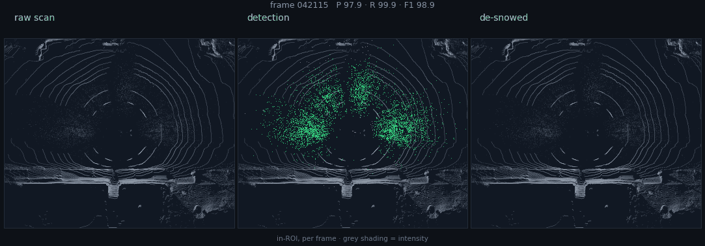

*一个场景、连续 21 帧、固定视角 —— 上排 **SnowClear**、下排 **ground truth**。三列各司其职：
**Raw scan** 是输入，**Removed** 是剔除了什么（我们的结果按标注是否同意着色：绿=同意，红=不同意），
**De-snowed** 是留下了什么（我们把本该剔除却留下的点标成蓝色）。两排共用同样的列，对比因此是直接的：
绿点少的地方是漏剔，出现红点的地方是误剔——"看起来干净"不再能冒充"剔对了"。*

**SnowClear 逐点去除 LiDAR 扫描中的降雪噪声，纯 CPU 约 10 ms/帧，无需训练、没有任何学习权重。**
输入一帧原始点云，输出去雪后的点云与雪点索引，且索引仍在输入点云自身的索引空间中。算法核心只链接
PCL、OpenMP 与 TBB，**从不链接 ROS**，因此同一套库既能离线运行也能作为 ROS 2 节点运行，两者输出
**逐位一致**——这一点由两道逐字节门禁强制保证，而不是靠声明。

| | |
|---|---|
| **精度** —— 16 场景 / 1 620 帧 | P 96.69 · R 89.98 · **F1 92.82** |
| **速度** —— Release 构建、纯 CPU | **≈ 10 ms**/帧，无需 GPU |
| **对比最强非学习基线** | F1 是它的 **2.4 倍**（SOR 37.93），且快 9 倍 |
| **是否需要训练** | 不需要 —— 无权重、无需下载数据集 |
| **输出** | 雪点索引，位于输入点云自身的索引空间 |

---

## 快速开始

| 组件 | 版本 |
|---|---|
| 系统 / ROS | Ubuntu 24.04（已测）· ROS 2 Jazzy |
| PCL | 1.10+（`common`、`filters`、`io`、`kdtree`、`search`）；**不需要** `pcl_ros` |
| 工具链 | C++17（g++ 9+）、TBB、OpenMP、Eigen、`yaml-cpp`（仅 CLI） |

```bash
source /opt/ros/jazzy/setup.bash
git clone https://github.com/p20030920p/SnowClear.git && cd SnowClear
colcon build --cmake-args -DCMAKE_BUILD_TYPE=Release   # -O0 会让耗时虚高约 10 倍
source install/setup.bash
```

离线运行 —— 不需要 ROS 图：

```bash
# 单帧
ros2 run snowclear_core snowclear_cli pcd_file:=/path/frame.pcd result_folder:=/path/gt

# 整个文件夹，并写出雪点索引
ros2 run snowclear_core snowclear_cli process_all_frames:=true pcd_folder:=/path/scans \
  result_folder:=/path/gt save_results:=true output_dir:=/tmp/out
```

作为 ROS 2 节点运行：

```bash
ros2 launch snowclear_ros snowclear.launch.py rviz:=true
```

| 话题 | 类型 | 说明 |
|---|---|---|
| `~/input/points` | `sensor_msgs/PointCloud2` | 订阅 |
| `~/output/points` | `sensor_msgs/PointCloud2` | 去雪后的点云 |
| `~/output/snow_points` | `sensor_msgs/PointCloud2` | 被剔除的点 |
| `~/output/snow_indices` | `std_msgs/Int32MultiArray` | 指向输入点云的索引 |

每个算法参数都是 ROS 2 参数，其默认值**就是**发布值，因此
`ros2 param set /snowclear score_threshold 0.6` 会在下一帧生效，params 文件永远只是覆盖。没有传感器
时可用 `ros2 run snowclear_ros scan_to_cloud.py --pcd frame.pcd --rate 1.0` 回放 PCD。细节见
[`docs/ROS2.md`](docs/ROS2.md)。

---

## 方法

每个点按顺序经过以下判定，后一步只看前一步留下的点：

1. **ROI 门控** —— 保留 `z ∈ [−1.0, 2.6] m`、`r ≤ 17 m`、仰角 `≥ −23°`。
2. **距离–强度打分** —— **弱**回波得分高：`s = (1 − I/T)^1.2`，阈值 `T(r, I)` 由一条 Gamma 形权重
   在光束最密处压低。
3. **零强度表面否决** —— 7 m 外、与高亮点相距 0.6 m 内的零回波属于表面伪影，不是雪。
4. **融合判定** —— `C = 0.7·s + 0.15·h_ag`，超过 `θ` 即接受；高度项上限 0.15，保证几何永远无法压过
   强度。

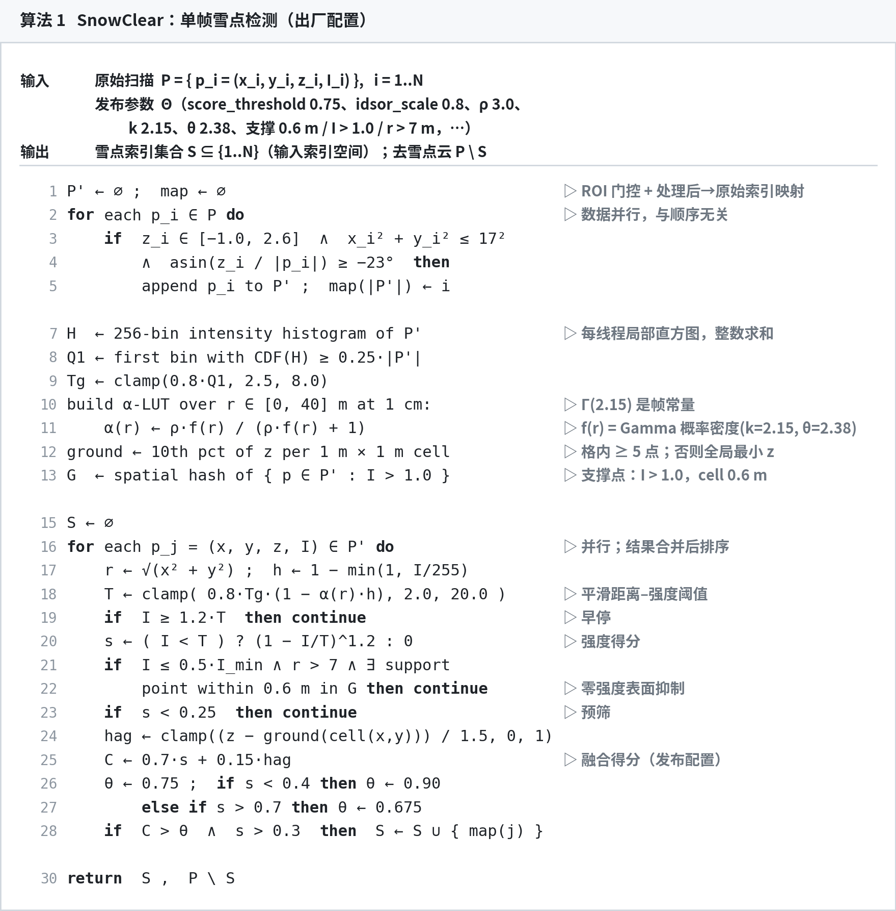

*算法 1 —— 整个检测器 25 行。推导、默认关闭的特性与全部常量见 [`docs/METHOD.md`](docs/METHOD.md)。*

---

## 实验结果

Release 构建、`OMP_NUM_THREADS=2`，单帧耗时不含 I/O 与评测；指标为 [WADS](https://digitalcommons.mtu.edu/wads/)
16 个场景 / 1 620 帧上按场景取的宏平均。每张图都由仓库内的工具生成，命令见
[`docs/figures/README.md`](docs/figures/README.md)。

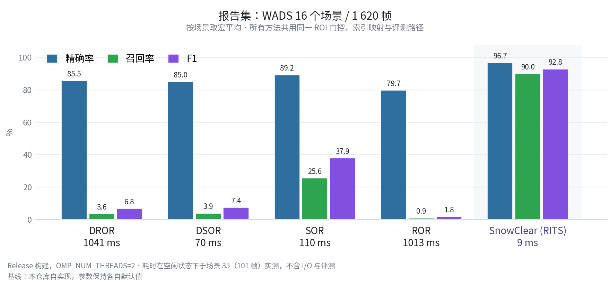

*与非学习基线的对比（同一批帧、同一条流水线）。SnowClear 的 F1 是最好的滤波器的 **2.4 倍**，而且差距
不是一点点：密度类滤波器的精确率之所以好看，是因为它们几乎什么都不返回——召回不足 4 %。*

| 方法 | 精确率 | 召回率 | F1 | ms / 帧 |
|---|---:|---:|---:|---:|
| DROR（Charron et al., CRV 2018） | 85.54 | 3.57 | 6.80 | 1041 |
| DSOR（Kurup & Bos, 2021） | 85.02 | 3.88 | 7.36 | 70 |
| SOR（Rusu et al., 2008） | 89.24 | 25.56 | 37.93 | 110 |
| ROR（Rusu, 2009） | 79.70 | 0.89 | 1.76 | 1013 |
| **SnowClear（RITS）** | **96.69** | **89.97** | **92.82** | **≈ 10** |

整张表可用 `bash tools/eval_baselines.sh <输出目录>` 复现。

|  |  |
|---|---|
| 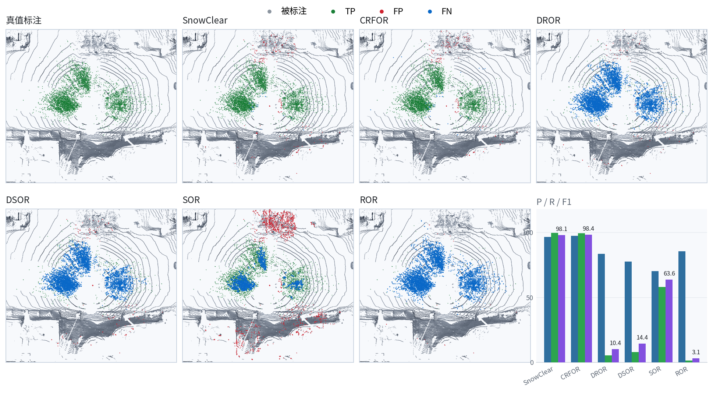 | 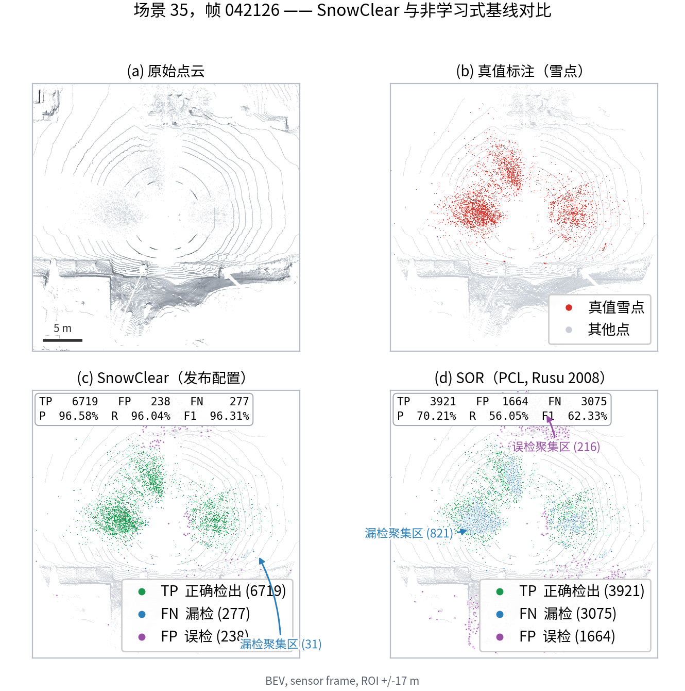 |
| *同一帧、五种检测器、同一相机。两种失效方式方向相反、且都是致命的：DROR / DSOR / ROR 根本没碰被标注的雪（蓝色），SOR 则把路面一起削掉（红色）。* | *同一帧与 SOR 的鸟瞰对比 —— 被剔除的雪是一层薄薄的覆盖物，不是一团云。* |
| 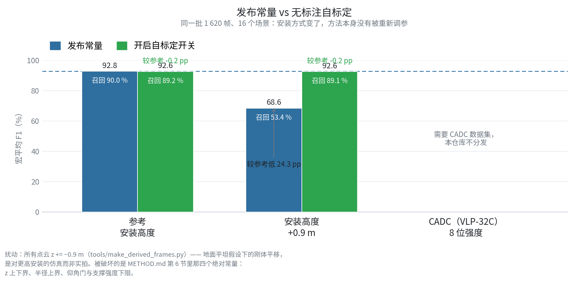 | 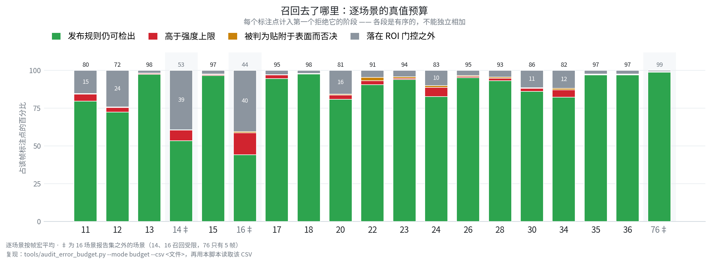 |
| *可移植性是实测的：抬高 0.9 m 让发布常量丢掉 **24.25 pp** F1，而自标定只差 0.06 pp。崩掉的是召回（89.97 → 53.42 %），精确率几乎不动。* | *召回去了哪里：89.90 % 的真值可达、实测召回 89.98 %，因此剩下的损失来自门控与强度上限，**不是**判定规则。* |

---

## 分析

上表数字背后的实测，按读者通常会追问的顺序排列。

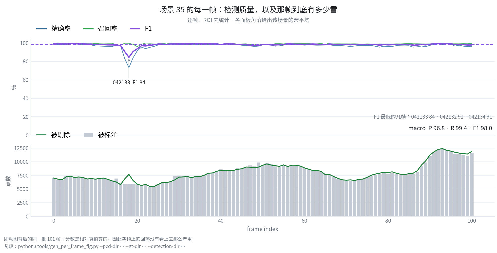

*动图那个场景的每一帧。质量非常平稳（101 帧 F1 98.0），而且剔除的点数与标注点数基本相当——这说明它没有
用召回换精确。三处回落都出现在雪层很薄的帧上，几个点就能让百分比动一下。*

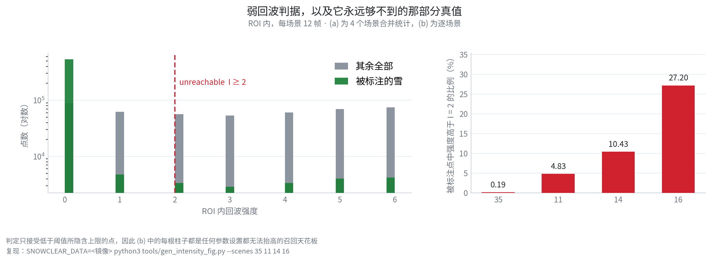

*为什么这里该用弱回波判据：场景 35 上 99.6 % 的被标注回波强度恰好为 0，而其余点里 98 % 更亮。但这个上限
并不均匀——它挡掉场景 35 的 0.19 % 标注，却挡掉场景 16 的 **27.20 %**，这正是场景 16 召回受限的原因。*

|  |  |
|---|---|
| 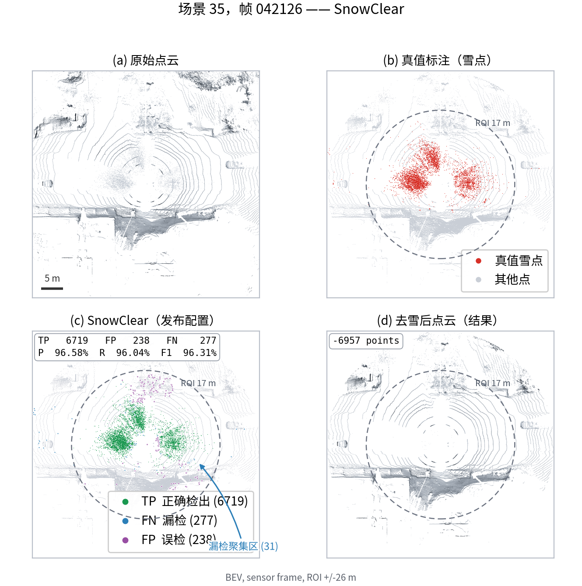 | 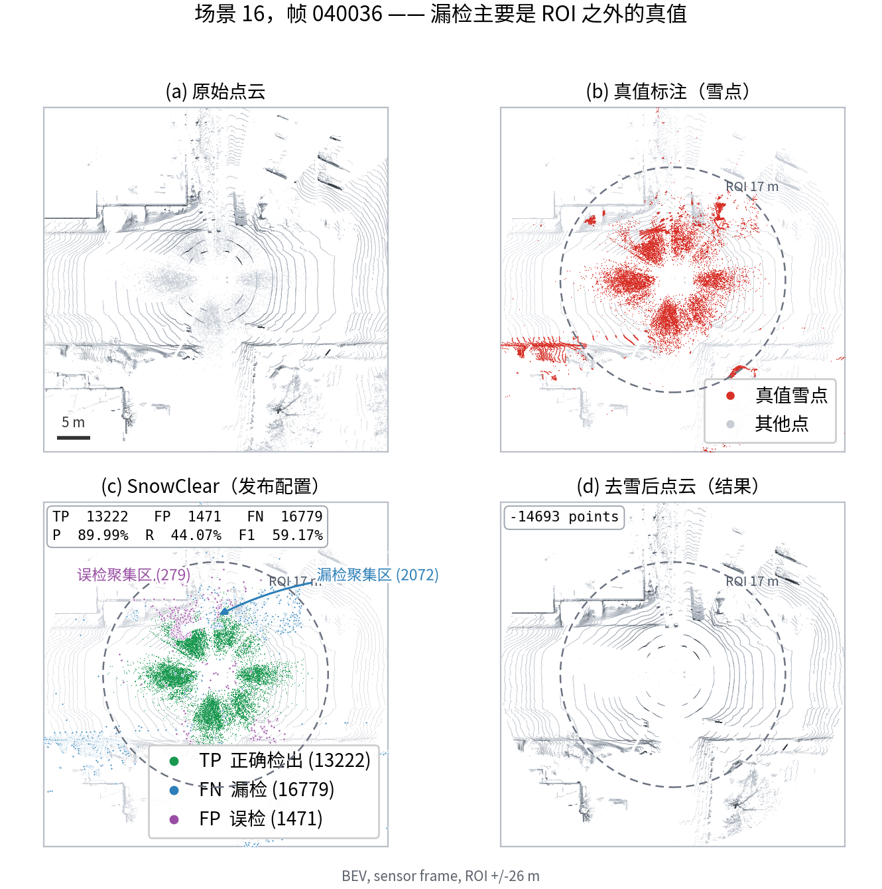 |
| *场景 35 的参考帧：检测与标注贴合得很好，剩下的只是 ROI 内沿边缘的几个簇。* | *另一端（场景 16，召回 44 %）：漏检大多落在 ROI **之外**，属于构造上不可达，而不是判定失误。* |
| 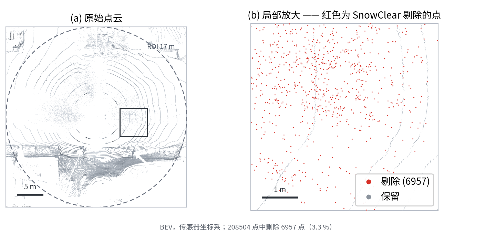 | 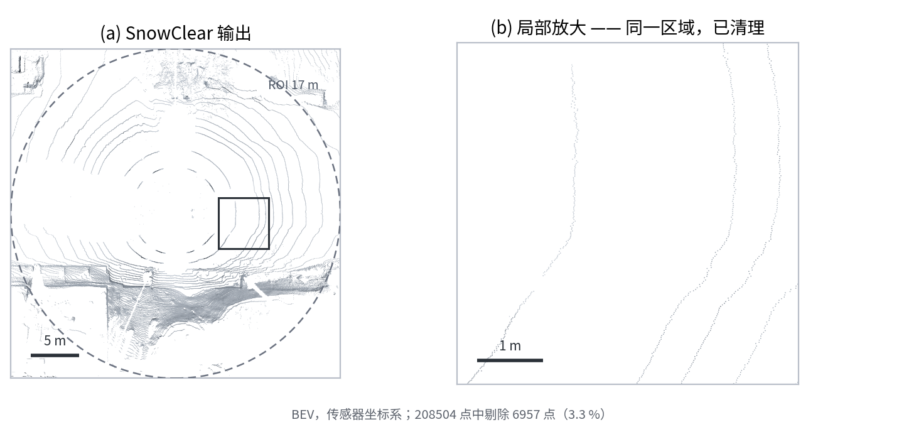 |
| *去雪前：整场加 5.2 m 局部放大，红色为将被剔除的点。* | *去雪后：同一区域已清理。该帧 208 504 点中剔除 6 957 点——是一层薄膜，不是一团云。* |
| 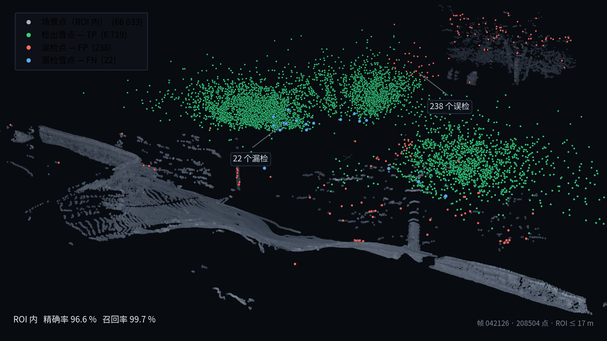 | 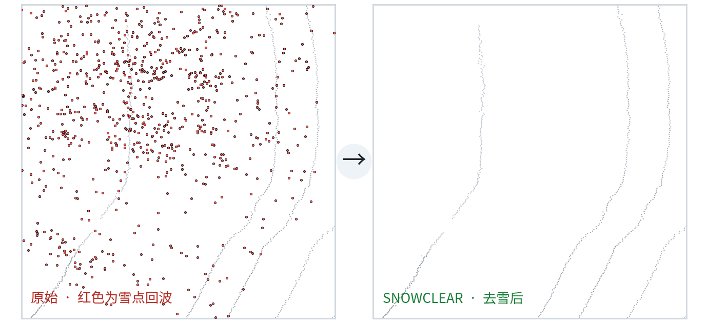 |
| *同一帧的三维透视图：雪浮在路**面之上**，这既解释了高度项为何在边缘处有用，也解释了为什么单靠几何无法承担判定。* | *同一组前后对照合成一张卡片，适合放进幻灯片或打印。* |

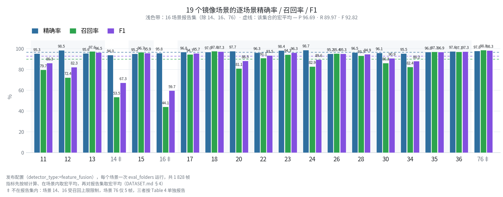

*逐场景结果（发布配置）。有两个场景落在报告带之外，而它们正是上图里"不可达占比"最大的两个——弱点是系统性
的，不是噪声。*

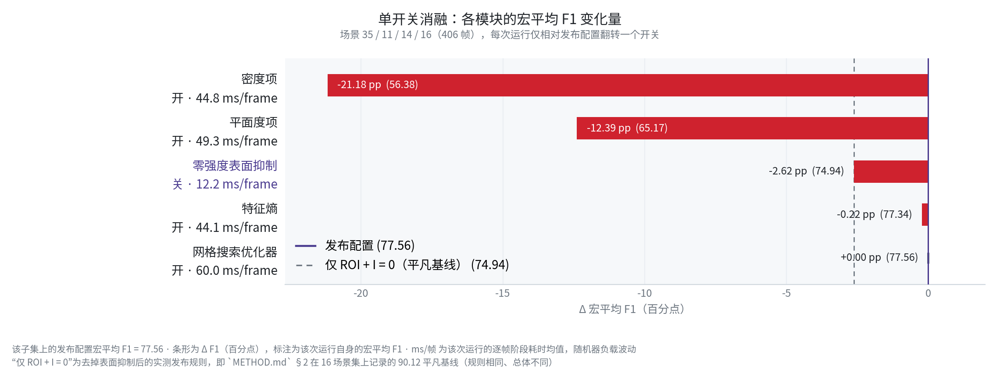

*每次只把一个开关从发布配置上翻转。所有默认关闭的模块一开启都掉 F1；网格搜索优化器只换来 +0.0012 pp，
却让单帧耗时约三倍——所以它最终返回默认值。*

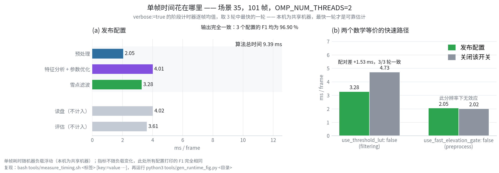

*预处理 2.05 ms、特征分析与参数优化 4.01 ms、雪点滤波 3.28 ms。`α(r)` 查表值配对 +1.53 ms；仰角快速
路径自身的收益低于这套计时器能分辨的幅度。*

|  |  |
|---|---|
| 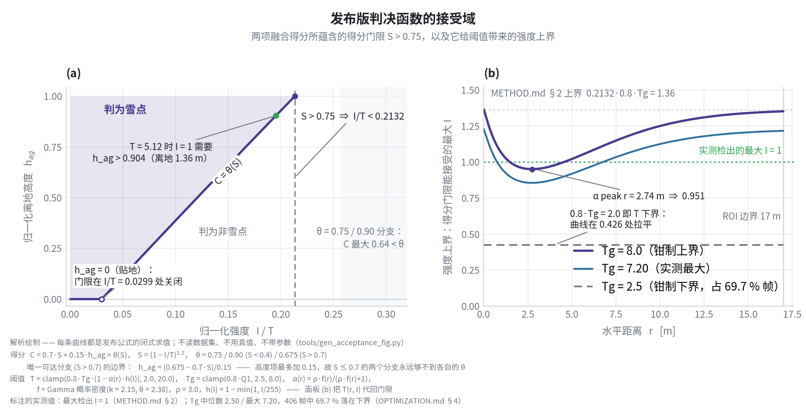 | 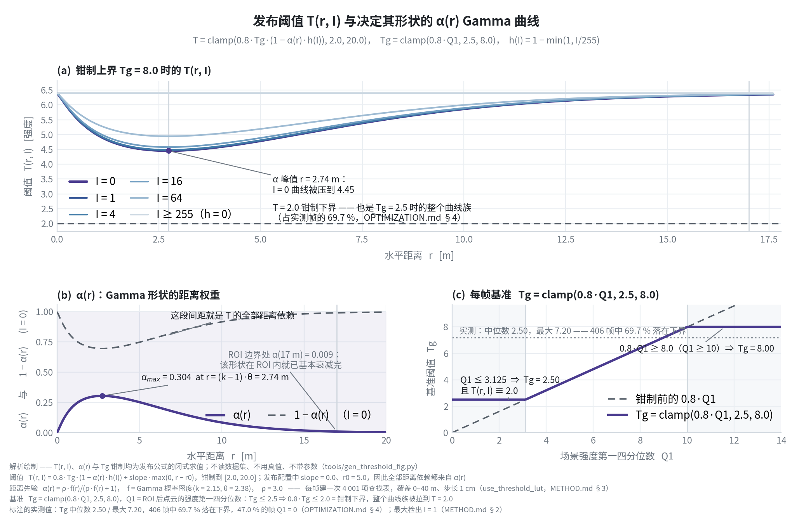 |
| *判定门的闭式结果。上限正好落在两个强度尖峰之间的空档里，因此在它的整个取值范围内挪动阈值几乎不改变结果。* | *阈值族 `T(r, I)`、塑造它的 `α(r)` 权重，以及在 69.7 % 的帧上被钳在下限的基阈值。* |

---

## 可复现性

```bash
SNOWCLEAR_DATA=/path/to/wads-mirror bash tools/verify.sh   # 干净构建 + 全部门禁
```

三道门禁都不贵：单元测试（`colcon test`）、离线逐字节门禁（`snowclear_runner --mode all_checks`，
逐字节复现发布参考输出）、在线逐字节门禁（`src/snowclear_ros/test/live_check.py`，证明 ROS 2 消息链
路给出的索引与离线一致）。任何可能改变检测结果的改动都必须让第二道门禁变红。数据布局与真值格式见
[`docs/DATASET.md`](docs/DATASET.md)。

---

## 文档

方法与发布常量 [`docs/METHOD.md`](docs/METHOD.md) &nbsp;·&nbsp; 节点参考
[`docs/ROS2.md`](docs/ROS2.md) &nbsp;·&nbsp; 包划分
[`docs/ARCHITECTURE.md`](docs/ARCHITECTURE.md) &nbsp;·&nbsp; 实测、消融与优先级路线
[`docs/OPTIMIZATION.md`](docs/OPTIMIZATION.md) &nbsp;·&nbsp; 图片索引
[`docs/figures/README.md`](docs/figures/README.md) &nbsp;·&nbsp; ROS 1 差异
[`docs/MIGRATION_ROS1.md`](docs/MIGRATION_ROS1.md)。

## 引用

```bibtex
@article{snowclear,
  title   = {SnowClear: Training-Free Snow-Point Detection and Removal for Spinning LiDAR
             via Range--Intensity Thresholding and Zero-Intensity Surface Suppression},
  author  = {TODO: authors},
  journal = {TODO: venue},
  year    = {TODO: year},
  url     = {https://github.com/p20030920p/SnowClear}
}
```

## 许可证

尚未选定 —— 见 [`LICENSE`](LICENSE)。第三方材料沿用其上游条款：`dynamic_outlier_filters.cpp` 中的
非学习基线实现遵循 [DROR](https://github.com/nickcharron/lidar_snow_removal)（Charron et al.,
CRV 2018）与 [DSOR](https://github.com/assasinXL/dsor_filter)（Kurup & Bos, 2021）。

## 联系

问题、缺陷与复现失败请开 issue —— 请附上 `--mode all_checks` 的输出与你的 `OMP_NUM_THREADS`。
