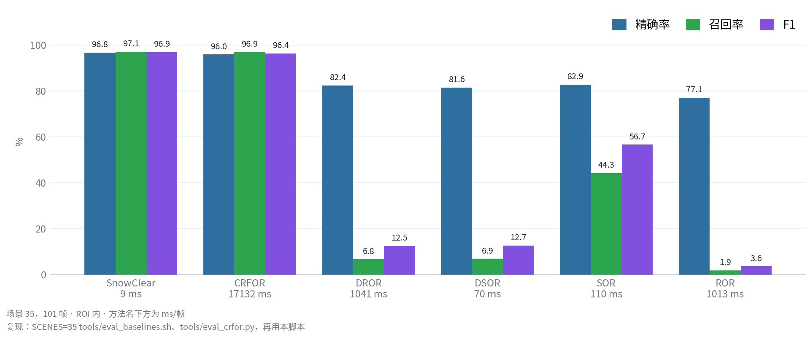

<div align="center">

# SVOR

**<b>S</b>urface-<b>V</b>eto <b>O</b>utlier <b>R</b>emoval**

旋转式 LiDAR 的免训练去雪方法

[](https://docs.ros.org/en/jazzy/)
[](https://en.cppreference.com/w/cpp/17)
[](https://pointclouds.org/)
[](#快速开始)

[快速开始](#快速开始) &nbsp;•&nbsp; [实验结果](#实验结果)

*[English](README.md) &nbsp;|&nbsp; 中文*

</div>


*场景 35，连续 21 帧，固定视角。上排 SVOR，下排真值；三列依次为原始点云、剔除、去雪后。
绿：剔除且被标注。红：剔除但无标注。蓝：被标注却保留。*

SVOR 面向旋转式 LiDAR 点云去除降雪噪声，无需训练、无学习权重，纯 CPU 约 10 ms/帧；核心不依赖 ROS，
既可离线调用，也可作为 ROS 2 节点运行。`SnowClear` 是它的参考实现，也是本仓库的名字。

雪的回波很弱，强度通常为 0，位置却和真实结构混在一起。留着的这些点会进入配准与建图，被当成场景的一部分；
SVOR 先把它们去掉。

| | |
|---|---|
| **精度** —— 16 场景 / 1 620 帧（WADS） | P 96.69 · R 89.98 · **F1 92.82** |
| **速度** —— 仅用 CPU | **≈ 10 ms**/帧 |
| **平台** | 华为 MateBook 14（2022 款）· Intel Core i5-1240P · Release · `OMP_NUM_THREADS=2` |
| **对比 CRFOR（RA-L 2023）** | F1 **96.90** vs **96.41** · 快 **≈ 1 900 倍**（9 vs 17 132 ms） |
| **是否需要训练** | 不需要 |
| **输出** | 雪点索引，位于输入点云自身的索引空间 |

## 快速开始

| 组件 | 版本 |
|---|---|
| 系统 / ROS | Ubuntu 24.04（已测）· ROS 2 Jazzy |
| PCL | 1.10+（`common`、`filters`、`io`、`kdtree`、`search`）；**不需要** `pcl_ros` |
| 工具链 | C++17（g++ 9+）、TBB、OpenMP、Eigen、`yaml-cpp`（仅 CLI） |

```bash
source /opt/ros/jazzy/setup.bash
git clone https://github.com/p20030920p/SnowClear.git && cd SnowClear
colcon build --cmake-args -DCMAKE_BUILD_TYPE=Release   # -O0 会让耗时虚高约 10 倍
source install/setup.bash
```

离线运行，不需要 ROS 图：

```bash
ros2 run snowclear_core snowclear_cli pcd_file:=/path/frame.pcd result_folder:=/path/gt
# 整个文件夹：process_all_frames:=true pcd_folder:=/path/scans save_results:=true output_dir:=/tmp/out
```

作为 ROS 2 节点运行 —— 输入 `PointCloud2`，输出除雪后的点云、被剔除的点与雪点索引，全部算法参数都以
ROS 2 参数声明：

```bash
ros2 launch snowclear_ros snowclear.launch.py rviz:=true
```

话题、参数、启动参数与诊断：见 [`docs/ROS2.md`](docs/ROS2.md)。

## 实验结果

指标按场景取宏平均；耗时不含 I/O 与评测。全部在同一台轻薄本上测得（华为 MateBook 14 2022 款、
Intel Core i5-1240P、Release 构建、无 GPU、`OMP_NUM_THREADS=2`），空闲状态运行：同一张表里测法相同的两个
方法，其倍数可迁移，绝对毫秒数不可迁移。复现命令见
[`docs/figures/README.md`](docs/figures/README.md)。

### 场景 35 —— 所有方法跑同一批 101 帧

| 方法 | 精确率 | 召回率 | F1 | ms / 帧 |
|---|---:|---:|---:|---:|
| **SVOR** | **96.79** | **97.07** | **96.90** | **≈ 9** |
| CRFOR（Wang et al., RA-L 2023） | 95.95 | 96.92 | 96.41 | 17 132 |
| DROR（Charron et al., CRV 2018） | 82.45 | 6.76 | 12.48 | 1041 |
| DSOR（Kurup & Bos, 2021） | 81.58 | 6.93 | 12.73 | 70 |
| SOR（Rusu et al., 2008） | 82.87 | 44.28 | 56.68 | 110 |
| ROR（Rusu, 2009） | 77.13 | 1.86 | 3.63 | 1013 |

*CRFOR 按其发布设置与自带预处理运行；四个滤波器与 SVOR 共用我们的。CRFOR 的数字由其官方仓库经
`tools/eval_crfor.py` 得到，其余来自 `SCENES=35 bash tools/eval_baselines.sh`。*


*帧 `042126`，所有面板共用同一窗口与同一真值。*

### 16 场景报告集 —— SVOR 与四个内置滤波器

| 方法 | 精确率 | 召回率 | F1 | ms / 帧 |
|---|---:|---:|---:|---:|
| DROR（Charron et al., CRV 2018） | 85.54 | 3.57 | 6.80 | 1041 |
| DSOR（Kurup & Bos, 2021） | 85.02 | 3.88 | 7.36 | 70 |
| SOR（Rusu et al., 2008） | 89.24 | 25.56 | 37.93 | 110 |
| ROR（Rusu, 2009） | 79.70 | 0.89 | 1.76 | 1013 |
| **SVOR** | **96.69** | **89.97** | **92.82** | **≈ 10** |

*按每帧约 17 s 计算，CRFOR 跑满 1 620 帧需要数小时，因此未列入本表。这些数字衡量的是什么、剩余误差在哪里，
见 [`docs/METHOD.md`](docs/METHOD.md) 与 [`docs/OPTIMIZATION.md`](docs/OPTIMIZATION.md)。*



*场景 35，101 帧，ROI 内。*

## 文档

- 方法与发布常量：[`docs/METHOD.md`](docs/METHOD.md)
- 节点参考：[`docs/ROS2.md`](docs/ROS2.md)
- 包划分：[`docs/ARCHITECTURE.md`](docs/ARCHITECTURE.md)
- 实测、消融与路线：[`docs/OPTIMIZATION.md`](docs/OPTIMIZATION.md)
- 图片索引与复现命令：[`docs/figures/README.md`](docs/figures/README.md)
- 与 ROS 1 版本的差异：[`docs/MIGRATION_ROS1.md`](docs/MIGRATION_ROS1.md)

## 引用

```bibtex
@misc{svor,
  title  = {Snow Removal for Spinning LiDAR Point Clouds with Surface-Veto Outlier Removal},
  author = {Zhu, Zilin},
  year   = {2026},
  note   = {Manuscript in preparation},
  url    = {https://github.com/p20030920p/SnowClear}
}
```
