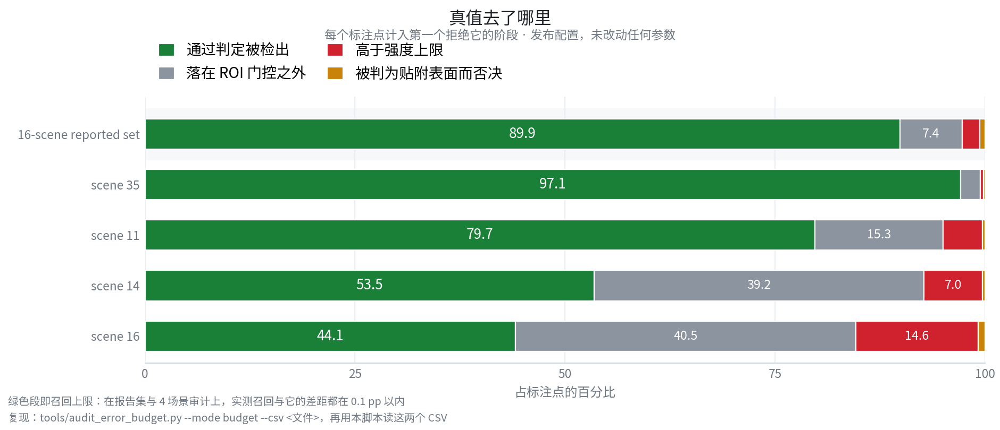

<div align="center">

# SnowClear

**基于 RITS 的旋转式 LiDAR 免训练去雪**

<sub><b>R</b>ange–<b>I</b>ntensity <b>T</b>hresholding with zero-intensity <b>S</b>urface suppression</sub>

[](https://docs.ros.org/en/jazzy/)
[](https://en.cppreference.com/w/cpp/17)
[](https://pointclouds.org/)
[](#快速开始)
[](#可复现性)
[](LICENSE)

[快速开始](#快速开始) &nbsp;•&nbsp; [方法](#方法) &nbsp;•&nbsp; [实验结果](#实验结果) &nbsp;•&nbsp; [文档](#文档)

*[English](README.md) &nbsp;|&nbsp; 中文*

</div>


*场景 35，连续 21 帧，固定视角。上排 SnowClear，下排真值；三列依次为原始点云、剔除、去雪后。
绿：剔除且被标注。红：剔除但无标注。蓝：被标注却保留。*

SnowClear 是一个面向旋转式 LiDAR 点云的降雪噪声去除库。纯 CPU 约 10 ms/帧，无需训练，无学习权重。

核心不依赖 ROS，可离线调用，也可作为 ROS 2 节点运行。

| | |
|---|---|
| **精度** —— 16 场景 / 1 620 帧 | P 96.69 · R 89.98 · **F1 92.82** |
| **速度** —— Release 构建、纯 CPU | **≈ 10 ms**/帧 |
| **对比最强非学习基线** | F1 为其 **2.4 倍**（SOR 37.93） |
| **是否需要训练** | 不需要 |
| **输出** | 雪点索引，位于输入点云自身的索引空间 |

## 快速开始

| 组件 | 版本 |
|---|---|
| 系统 / ROS | Ubuntu 24.04（已测）· ROS 2 Jazzy |
| PCL | 1.10+（`common`、`filters`、`io`、`kdtree`、`search`）；**不需要** `pcl_ros` |
| 工具链 | C++17（g++ 9+）、TBB、OpenMP、Eigen、`yaml-cpp`（仅 CLI） |

```bash
source /opt/ros/jazzy/setup.bash
git clone https://github.com/p20030920p/SnowClear.git && cd SnowClear
colcon build --cmake-args -DCMAKE_BUILD_TYPE=Release   # -O0 会让耗时虚高约 10 倍
source install/setup.bash
```

离线运行，不需要 ROS 图：

```bash
# 单帧
ros2 run snowclear_core snowclear_cli pcd_file:=/path/frame.pcd result_folder:=/path/gt

# 整个文件夹，并写出雪点索引
ros2 run snowclear_core snowclear_cli process_all_frames:=true pcd_folder:=/path/scans \
  result_folder:=/path/gt save_results:=true output_dir:=/tmp/out
```

作为 ROS 2 节点运行：

```bash
ros2 launch snowclear_ros snowclear.launch.py rviz:=true
```

| 话题 | 类型 | 说明 |
|---|---|---|
| `~/input/points` | `sensor_msgs/PointCloud2` | 订阅 |
| `~/output/points` | `sensor_msgs/PointCloud2` | 去雪后的点云 |
| `~/output/snow_points` | `sensor_msgs/PointCloud2` | 被剔除的点 |
| `~/output/snow_indices` | `std_msgs/Int32MultiArray` | 指向输入点云的索引 |

所有算法参数都是 ROS 2 参数，默认值即发布值。`ros2 param set /snowclear score_threshold 0.6`
会在下一帧生效。无传感器时回放 PCD：
`ros2 run snowclear_ros scan_to_cloud.py --pcd frame.pcd --rate 1.0`。节点参考：
[`docs/ROS2.md`](docs/ROS2.md)。

## 方法

每个点依次经过四步判定，后一步只看前一步留下的点。

1. **ROI 门控** —— `z ∈ [−1.0, 2.6] m`、`r ≤ 17 m`、仰角 `≥ −23°`。
2. **距离–强度打分** —— 弱回波得分高：`s = (1 − I/T)^1.2`；`T(r, I)` 在光束最密处降低。
3. **表面否决** —— 7 m 之外、与高亮点相距 0.6 m 内的零回波被拒绝。
4. **判定** —— `C = 0.7·s + 0.15·h_ag` 超过 `θ` 即接受；高度项上限 0.15。


*算法 1。常量与默认关闭的特性见 [`docs/METHOD.md`](docs/METHOD.md)。*

## 实验结果

Release 构建、`OMP_NUM_THREADS=2`；耗时不含 I/O 与评测。指标按场景取宏平均。复现命令见
[`docs/figures/README.md`](docs/figures/README.md)。


*帧 `042126`，所有面板共用同一窗口与同一真值。CRFOR（Wang et al., RA-L 2023）按其发布设置与自带
预处理运行；四个滤波器与 SnowClear 共用我们的。*


*场景 35，101 帧，ROI 内；耗时取空闲单场景运行。*

### 场景 35 —— 所有方法跑同一批 101 帧

| 方法 | 精确率 | 召回率 | F1 | ms / 帧 |
|---|---:|---:|---:|---:|
| **SnowClear** | **96.79** | **97.07** | **96.90** | **≈ 9** |
| CRFOR（Wang et al., RA-L 2023） | 95.95 | 96.92 | 96.41 | 17 132 |
| DROR（Charron et al., CRV 2018） | 82.45 | 6.76 | 12.48 | 1041 |
| DSOR（Kurup & Bos, 2021） | 81.58 | 6.93 | 12.73 | 70 |
| SOR（Rusu et al., 2008） | 82.87 | 44.28 | 56.68 | 110 |
| ROR（Rusu, 2009） | 77.13 | 1.86 | 3.63 | 1013 |

CRFOR 的数字由其官方仓库经 `tools/eval_crfor.py` 得到；其余来自
`SCENES=35 bash tools/eval_baselines.sh`。

### 16 场景报告集 —— SnowClear 与四个内置滤波器

| 方法 | 精确率 | 召回率 | F1 | ms / 帧 |
|---|---:|---:|---:|---:|
| DROR（Charron et al., CRV 2018） | 85.54 | 3.57 | 6.80 | 1041 |
| DSOR（Kurup & Bos, 2021） | 85.02 | 3.88 | 7.36 | 70 |
| SOR（Rusu et al., 2008） | 89.24 | 25.56 | 37.93 | 110 |
| ROR（Rusu, 2009） | 79.70 | 0.89 | 1.76 | 1013 |
| **SnowClear（RITS）** | **96.69** | **89.97** | **92.82** | **≈ 10** |

按每帧约 17 s 计算，CRFOR 跑满 1 620 帧需要数小时，因此未列入本表。



*发布配置的真值预算：每个标注点计入第一个拒绝它的阶段。绿色段为召回上限（报告集 89.90 %，实测
89.98 %）；场景 16 上 ROI 门控占 40.5 %、强度上限占 14.6 %。*

其余图见 [`docs/figures/README.md`](docs/figures/README.md)。

## 可复现性

```bash
SNOWCLEAR_DATA=/path/to/wads-mirror bash tools/verify.sh   # 干净构建 + 全部门禁
```

三道门禁：单元测试（`colcon test`）、离线逐字节门禁（`--mode all_checks`）、在线逐字节门禁
（`src/snowclear_ros/test/live_check.py`）。任何可能改变检测结果的改动都会让第二道变红。数据布局见
[`docs/DATASET.md`](docs/DATASET.md)。

## 文档

- 方法与发布常量：[`docs/METHOD.md`](docs/METHOD.md)
- 节点参考：[`docs/ROS2.md`](docs/ROS2.md)
- 包划分：[`docs/ARCHITECTURE.md`](docs/ARCHITECTURE.md)
- 实测、消融与路线：[`docs/OPTIMIZATION.md`](docs/OPTIMIZATION.md)
- 图片索引与复现命令：[`docs/figures/README.md`](docs/figures/README.md)
- 与 ROS 1 版本的差异：[`docs/MIGRATION_ROS1.md`](docs/MIGRATION_ROS1.md)

## 引用

```bibtex
@article{snowclear,
  title   = {SnowClear: Training-Free Snow-Point Detection and Removal for Spinning LiDAR
             via Range--Intensity Thresholding and Zero-Intensity Surface Suppression},
  author  = {TODO: authors},
  journal = {TODO: venue},
  year    = {TODO: year},
  url     = {https://github.com/p20030920p/SnowClear}
}
```

## 许可证

尚未选定；见 [`LICENSE`](LICENSE)。`dynamic_outlier_filters.cpp` 中的非学习基线实现遵循
[DROR](https://github.com/nickcharron/lidar_snow_removal)（Charron et al., CRV 2018）与
[DSOR](https://github.com/assasinXL/dsor_filter)（Kurup & Bos, 2021）。

## 联系

缺陷与复现失败请开 issue，并附上 `--mode all_checks` 的输出与你的 `OMP_NUM_THREADS`。
