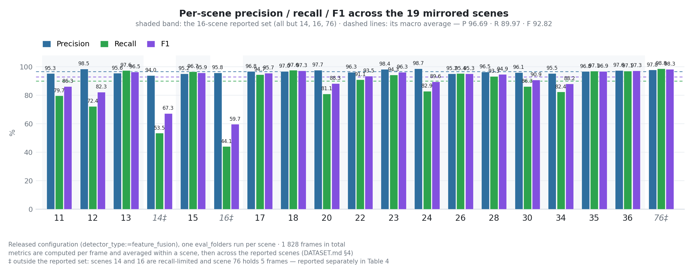
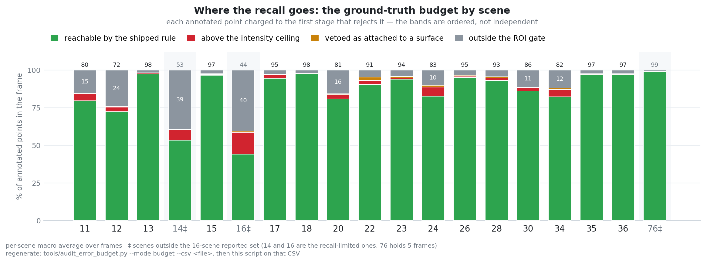

# Dataset

> No point clouds are distributed with this repository. `data/` is
> git-ignored — the local mirror is ~5.9 GB. This document describes the exact layout the
> code expects, the ground-truth format, and how the evaluation split is defined.

---

## 1. Source

The evaluation set is the **[Winter Adverse Driving dataSet (WADS)][wads]** from Michigan
Technological University — repeated winter drives with a 64-beam mechanical spinning LiDAR,
annotated for falling-snow points.

The mirror used here was produced by an author-local script
(`experiments/baselines/build_wads_mirror.py`) that is **not part of this repository**,
because it lives in the git-ignored `experiments/baselines/` tree. Reproducing the mirror
therefore requires obtaining the source sequences and applying the layout described in §2;
the per-point content is unchanged.

[wads]: https://digitalcommons.mtu.edu/wads/

---

## 2. Expected layout

```text
data/
├── pcd_output/
│   ├── 11/velodyne/039498.pcd
│   ├── 11/velodyne/039499.pcd
│   ├── …
│   └── <scene_id>/velodyne/<frame_id>.pcd
└── result/
    ├── 11/039498.txt
    ├── …
    └── <scene_id>/<frame_id>.txt
```

Two properties of this layout are load-bearing and easy to break:

1. **The scan directory level (`velodyne/`) is optional but the scene level is not.** The
   ground-truth resolver in `src/cloud_operations.cpp` tries, in order:
   `result/<relative parent>/<stem>.txt`, the same path with a `velodyne` component removed,
   `result/<basename of pcd_folder>/<stem>.txt`, and finally the flat `result/<stem>.txt`.
   A *flattened* subset (all PCDs symlinked into one directory) therefore matches **no**
   ground truth, every frame is treated as unlabelled, and the metrics silently come out
   empty. Keep the `<scene_id>/` level.
2. **Frame stems are not unique across scenes.** Frames `039940`–`039944` exist in both
   scene 15 and scene 76. Any flattened layout will collide on them.

### PCD format

Binary PCD v0.7, single scan per file, unorganised:

```text
# .PCD v0.7 - Point Cloud Data file format
VERSION 0.7
FIELDS x y z intensity
SIZE 4 4 4 4
TYPE F F F F
COUNT 1 1 1 1
WIDTH 208504
HEIGHT 1
VIEWPOINT 0 0 0 1 0 0 0
POINTS 208504
DATA binary
```

All four fields are little-endian `float32`, so a point is exactly 16 bytes. `intensity`
is an integer-valued 8-bit-like scale (observed range 0–255); the released configuration's
absolute thresholds assume that scale — see `docs/METHOD.md` §6.

### Ground-truth format

Plain text, one entry per line, `index,class`:

```text
64, 110
74, 110
129, 110
```

* `index` — the 0-based index of the point in the **corresponding PCD file**, i.e. after
  the reader's own ordering, before any filtering.
* `class` — always `110` in this dataset (the snow class). **The loader ignores it** and
  accepts a bare index too; the label is preserved in the files only for provenance.

Under `strict_evaluation` (the default) the loader also:

* rejects trailing garbage rather than silently parsing a prefix (`std::from_chars` with a
  full-consumption check);
* discards negative indices, which would otherwise corrupt the confusion matrix;
* de-duplicates the list, so a repeated index does not inflate the false-negative count;
* treats an **empty but readable** file as "this frame has zero snow points" and still
  evaluates it, so an over-detecting method is penalised on snow-free frames. Only a
  *missing* file causes a frame to be skipped.

---

## 3. What is actually present

| | Scenes | Frames |
|---|---:|---:|
| **Reported evaluation set** | **16** | **1 620** |
| Extra scenes present in the mirror | 3 (14, 16, 76) | 208 |
| Total in the local mirror | 19 | 1 828 |

Per-scene frame counts:

```text
11:102  12:101  13:101  14:101  15:102  16:102  17:101  18:101  20:101
22:101  23:101  24:101  26:101  28:102  30:101  34:101  35:101  36:102
76:5
```

`16 × ~101 = 1 620` — the "1 620 frames" quoted in the paper is exactly the 16-scene set.

### The three extra scenes

Scenes **14**, **16** and **76** use the same `class 110` ground-truth format and are
perfectly valid data; they are simply not part of the paper's evaluation set. They are
reported separately rather than deleted, because they are informative:

| Scene | Precision | Recall | F1 |
|---|---:|---:|---:|
| 14 | 93.96 | 53.47 | 67.34 |
| 16 | 95.82 | 44.13 | 59.74 |
| 76 (5 frames) | 97.85 | 98.84 | 98.34 |

Including them moves the macro average over scenes from `96.6934 / 89.9765 / 92.8229` to
`96.5654 / 86.1053 / 90.0295`. (Both rows are unweighted means over scenes; weighting by frame
count instead gives 85.43 for the all-19 recall, because scene 76 holds only 5 frames.)

Scenes 14 and 16 are **recall-limited**: precision stays at 94–96 %, so the detector is not
hallucinating snow, it is failing to reach snow that the ground truth marks. The cause is
structural and follows directly from the released parameters: a large fraction of the
ground-truth points in those scenes have `intensity ≥ 2`, and no point with `I ≥ 2` can be
emitted by the released decision function (`docs/METHOD.md` §2). Any change that widens the
admissible intensity range should be evaluated on these three scenes specifically — they are
the only scenes in the mirror where that limit actually binds.

<!-- Fig. 1 (shared) — drop docs/figures/fig1_per_scene.png in, then uncomment:

-->
*Fig. 1 — Per-scene precision / recall / F1, scenes 14 and 16 visibly recall-limited.
Published as [`figures/fig1_per_scene.png`](figures/fig1_per_scene.png).*

---

## 4. Evaluation protocol

* Metrics are computed **per frame** and then macro-averaged; a pooled variant over all
  frames is reported alongside. The two differ (`92.8229` vs `92.6181` on the 16-scene set)
  and both are reported rather than picking the flattering one.
* `accuracy` over the whole frame is meaningless here: the ROI gate removes ~73 % of the
  points before the detector ever sees them, and those points are trivially "true
  negatives". The strict protocol therefore reports accuracy over the **evaluated subset**
  only. Prefer precision / recall / F1 in any write-up.
* Ground-truth points removed by the ROI gate are counted as **false negatives**. They are a
  hard recall ceiling: measured at 7.38 % loss over the 16-scene set and 10.45 % over all
  1 828 frames. The original audit report is not distributed with this repository; see
  [`MIGRATION_ROS1.md`](MIGRATION_ROS1.md) §5.

  <!-- Fig. 8 — drop docs/figures/fig8_gt_ceiling.png in, then uncomment:
  
  -->
  *Fig. 8 — Recall ceiling imposed by the ROI gate, by scene. Published as
  [`figures/fig8_gt_ceiling.png`](figures/fig8_gt_ceiling.png).*
* To save the detection indices for an independent audit:

  ```bash
  ros2 run snowclear_core snowclear_cli \
    process_all_frames:=true \
    pcd_folder:=$WS/data/pcd_output \
    result_folder:=$WS/data/result \
    save_results:=true output_dir:=/tmp/audit_output
  ```

  Output preserves the scene sub-path: `/tmp/audit_output/<scene>/velodyne/<stem>.txt`,
  identical in format to the ground truth. Note that the original audit tooling (see MIGRATION_ROS1.md) currently
  expects a *flat* directory — flatten manually or fix the script before use.

---

## 5. Adding your own data

1. Convert each scan to binary PCD v0.7 with exactly `x y z intensity` as `float32`.
2. Place it at `data/pcd_output/<your_scene>/velodyne/<stem>.pcd`.
3. Place the labels at `data/result/<your_scene>/<stem>.txt` as `index,class` lines. An
   empty file is a valid "no snow" label; a missing file means "not annotated" and the frame
   is skipped.
4. Verify the indices refer to the PCD's own point order — a systematic off-by-one silently
   destroys the metrics, and the original audit tooling (see MIGRATION_ROS1.md) is the tool that catches it.
5. Run `ros2 run snowclear_core snowclear_runner --mode eval_folders` and check the reported frame counts match
   the files on disk.

If the new sensor does not use an 8-bit-like intensity scale, or is mounted at a different
height, read `docs/METHOD.md` §6 first: the released configuration's absolute thresholds
will not transfer, and self-calibration must be enabled deliberately.
