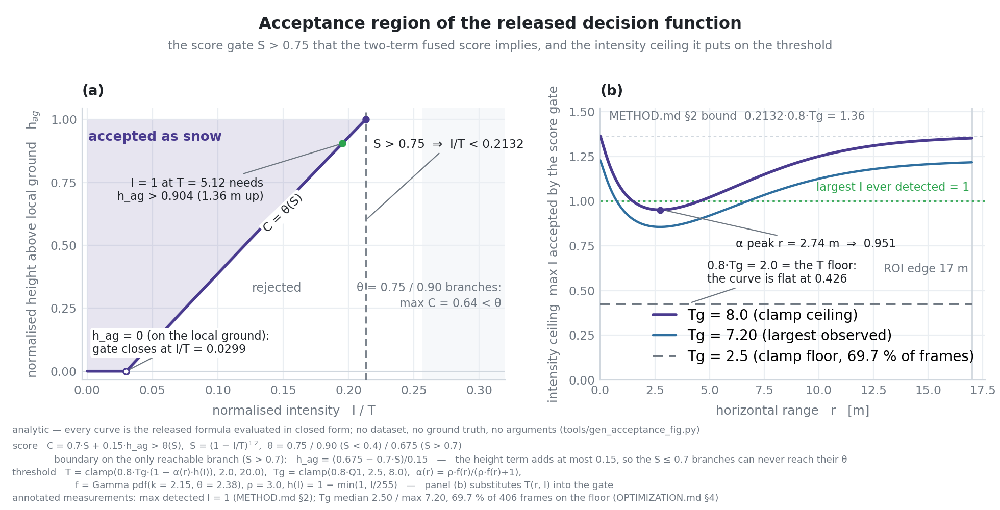
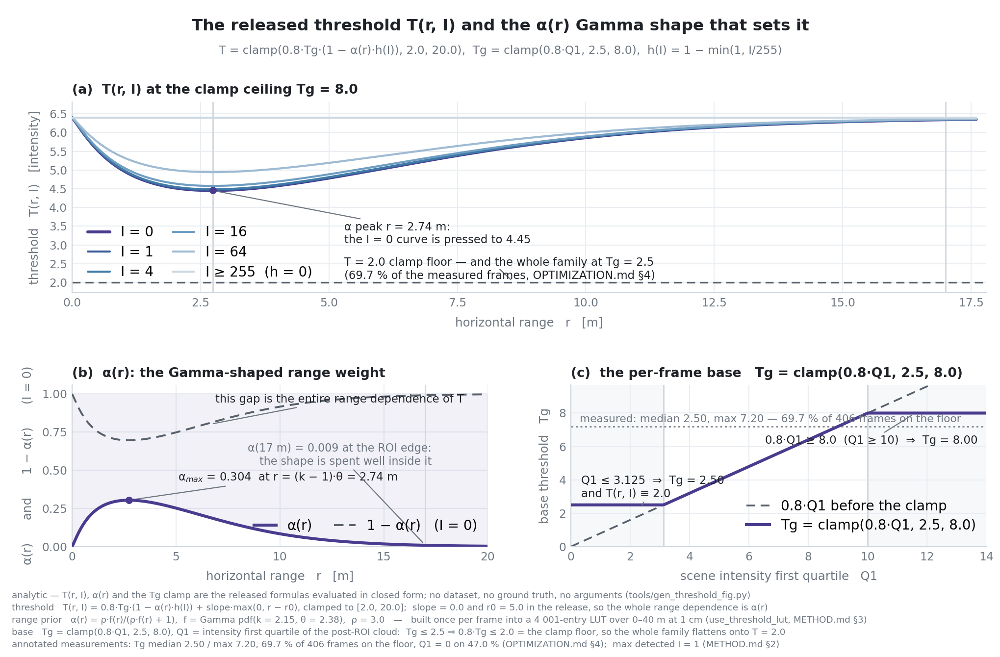
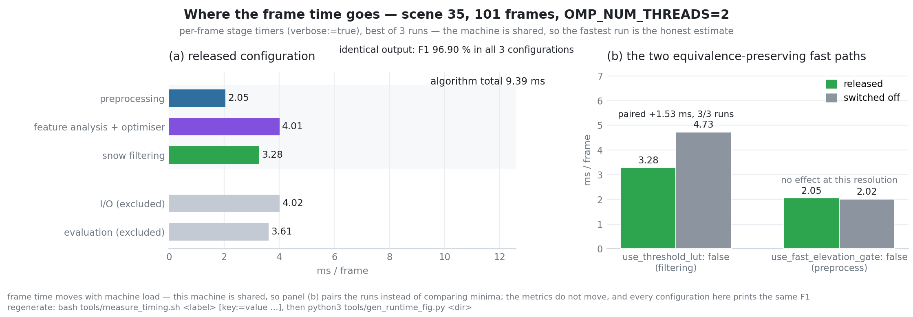
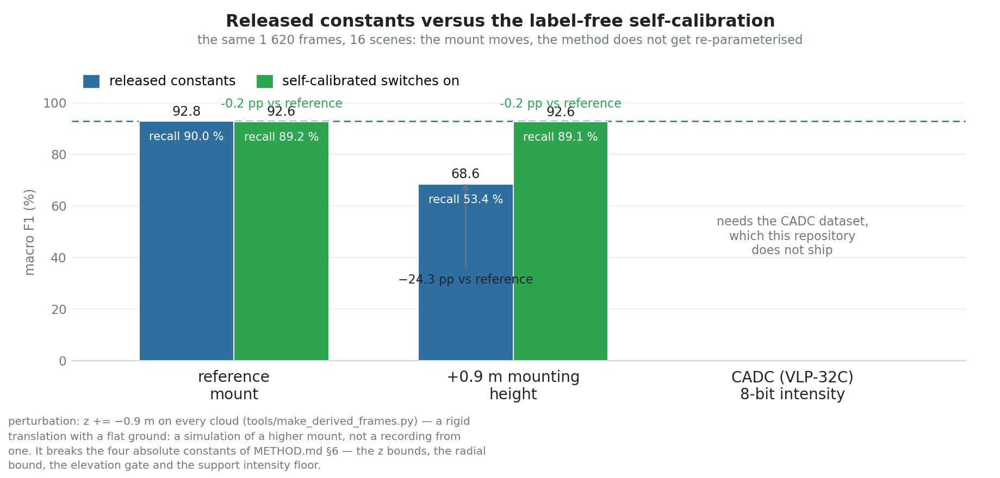

# The method, exactly as shipped

> This document describes what the **released configuration** actually computes — not what
> the paper describes in general. The two differ: several features that the paper presents
> as part of the pipeline are switched **off** in `config/snowclear_params.yaml`, and the fused
> score collapses to a much simpler rule. Read this before changing any parameter, and
> before writing a rebuttal that cites a module the released configuration never enables.
>
> Owner of the released configuration: `src/snowclear_ros/config/snowclear_params.yaml`, mirrored
> by the defaults in `include/snowclear/system_config.hpp` / `include/snowclear/ablation_switches.hpp` and by
> `launch/snowclear.launch.py`. `snowclear_runner --mode param_check` fails if the
> three copies disagree.

---

## 1. Pipeline

One frame, six stages, all in the sensor frame:

| # | Stage | Module | What it does |
|---|---|---|---|
| 1 | ROI gate | `src/preprocessor.cpp` | keeps `z ∈ [−1.0, 2.6] m`, horizontal range `≤ 17 m`, elevation `≥ −23°`; maintains `processed → original` index mapping |
| 2 | Scene statistics | `src/feature_extractor.cpp` | 256-bin intensity histogram → Q1; 1 m × 1 m local ground grid (10th percentile of `z` per cell) |
| 3 | Threshold construction | `src/parameter_optimizer.cpp` | base threshold `Tg = clamp(0.8·Q1, 2.5, 8.0)`, then the smooth range–intensity form `T(r, I)` |
| 4 | Per-point decision | `src/snow_detector.cpp` | intensity score + relative-height term, local threshold adjustment, zero-intensity surface veto |
| 5 | Index mapping | `src/cloud_operations.cpp` | processed index → original index (with exact-duplicate group expansion) |
| 6 | Evaluation / output | `src/evaluator.cpp` | confusion matrix against ground truth under the strict protocol; optional `index,class` dump |

Optional stages that are **off** in the released configuration: voxel pre-downsampling,
exact-duplicate merging, radius outlier removal, grid-search parameter optimisation,
scene-adaptive parameter recommendation, downsampled-result propagation.

---

## 2. The decision function

With the released switches, `SnowDetector::needs_knn()` returns `false`, so stage 4 builds no
KD tree and performs no neighbour query at all. `evaluate_point()` then reduces to:

```
T   = threshold_at(x, y, I)                      # stage 3, see §3
if I >= 1.2 · T                                → not snow          # early stop
S   = (I < T) ? (1 − I/T)^1.2 : 0              # intensity score

if I ≤ 0.5 and r > 7.0 and ∃ support point (I > 1.0) within 0.6 m
                                               → not snow          # surface veto, §4
if S < 0.25                                    → not snow          # pre-filter

hag = clamp((z − ground_z(cell)) / 1.5, 0, 1)  # normalised height above local ground
C   = 0.7 · S + 0.15 · hag                     # fused score

θ   = 0.75                                      # score_threshold
if S < 0.4 : θ = 0.90
elif S > 0.7 : θ = 0.675
                                               # (the planarity branch is dead, §5)

snow ⟺ C > θ  and  S > 0.3
```

Two consequences are worth stating explicitly, because both are easy to miss:

**(a) The fused score is a two-term rule.** `weight_sum` is `0.35 + 0.15 = 0.50`, because
the planarity and density weights are excluded when their switches are off. So the score is
`(0.35/0.50)·S + (0.15/0.50)·H` with `H = 0.5·hag ∈ [0, 0.5]`, i.e. `0.7·S + 0.15·hag`.
The height term can contribute **at most 0.15** against a threshold of 0.675–0.90.

**(b) No point with `I ≥ 2` can ever be classified as snow.** Solving
`0.7·S + 0.15·hag > θ` for the three branches of `θ` gives:

| `S` range | `θ` | maximum achievable `C` | reachable? |
|---|---:|---:|---|
| `S ≤ 0.4` | 0.90 | `0.7·0.4 + 0.15 = 0.43` | **never** |
| `0.4 < S ≤ 0.7` | 0.75 | `0.7·0.7 + 0.15 = 0.64` | **never** |
| `S > 0.7` | 0.675 | `0.7·S + 0.15` | possible |

so detection requires `S > 0.75`, i.e.

```
(1 − I/T)^1.2 > 0.75   ⟹   I / T < 0.2132
```

Because `T ≤ 0.8 · Tg ≤ 0.8 · 8.0 = 6.4` in every frame, the acceptance region is bounded by
`I < 0.2132 · 6.4 = 1.36` at the very best — and 0.43–1.35 once the ceiling is solved
self-consistently, §3 — and `I < 0.19` for a point sitting on the ground
(`hag = 0`). The surface veto is not involved in this bound — it only ever **removes** points.

Measured on the released build:

| Frame | Detected | max intensity of a detected point | share with `I ≤ 1` |
|---|---:|---:|---:|
| `35/042126` (reference frame) | 6 957 | **1** | 100.00 % |
| `11/039498` | 17 633 | **0** | 100.00 % |
| `14/039816` | 11 054 | **0** | 100.00 % |
| `16/040036` | 14 693 | **0** | 100.00 % |
| `30/041570` | 21 293 | **0** | 100.00 % |
| `36/042223` | 10 559 | **0** | 100.00 % |

`I = 1` is reachable only for a point well above the local ground: at `T = 5.12` the branch
requires `hag > 0.90`, i.e. more than **1.35 m** above the local ground surface. `I = 0`
always passes the score test (it gives `S = 1`, `C = 0.7 > 0.675`) and is then filtered only
by the surface veto.

<!-- Fig. 5 — drop docs/figures/fig5_acceptance.png in, then uncomment:

-->


*Fig. 5 — The `S > 0.75` requirement implied by the two-term score, and the ceiling it puts on the
intensity. Regenerate with `python3 tools/gen_acceptance_fig.py`.*

> **Practical implication.** On this dataset, ground truth snow is itself dominated by
> `I ≈ 0` points. A rule consisting of the ROI gate plus `I = 0` already reproduces
> **90.12** macro F1 on the 16-scene set (vs 92.82 for the full pipeline); see
> the original audit report (see MIGRATION_ROS1.md) and the discussion in the repository README. Any claim about the
> marginal value of the pipeline's components should be stated relative to that baseline,
> not relative to the geometric baselines alone.

---

## 3. Threshold construction

```text
Tg        = clamp(0.8 · Q1, 2.5, 8.0)                 # Q1 = scene intensity first quartile
h(I)      = 1 − min(1, I / 255)
α(r)      = ρ·f(r) / (ρ·f(r) + 1),  f(r) = Gamma pdf with k = 2.15, θ = 2.38
T(r, I)   = s · Tg · (1 − α(r)·h(I)) + slope · max(0, r − r0)
          = 0.8 · Tg · (1 − α(r)·h(I))                 # slope = 0.0 in the release
T         = max(2.0, min(20.0, T(r, I)))               # the upper clamp never binds
```

The **lower** clamp is the one that binds. For any `Tg ≤ 2.5` the raw expression is `≤ 2.0` for
every `(r, I)`, so `T ≡ 2.0` and the `α(r)` shape disappears completely; `Tg` sits on that floor in
69.7 % of frames ([`OPTIMIZATION.md`](OPTIMIZATION.md) §4), which makes the released threshold a
constant on most frames and the "range-adaptive threshold" a property of the frames that happen to
sit above the floor. It also tightens the ceiling: solving `I = 0.2132·T(r, I)` self-consistently
gives `I < 0.426` at the floor, `0.951` at the `α` peak and `1.352` at the ROI edge, against the
`1.36` supremum of §2 — which requires `I ≥ 255` to be attained, i.e. it is never the operating
point. [`figures/fig9_threshold_curve.png`](figures/fig9_threshold_curve.png) draws both.

`α(r)` depends only on range, and `Γ(k)` is a per-frame constant, so the whole α curve is
built once per frame into a 4 001-entry LUT over 0–40 m at 1 cm resolution
(`use_threshold_lut`, a measured 1.140 ms → 0.179 ms per ROI frame).

<!-- Fig. 9 — drop docs/figures/fig9_threshold_curve.png in, then uncomment:

-->


*Fig. 9 — (a) `T(r, I)` at the clamp ceiling, the `I = 0` curve showing where the range term does its
work; (b) the `α(r)` Gamma weight, peaked at 2.74 m — this is the entire range dependence of `T`;
(c) the per-frame base threshold `Tg = clamp(0.8·Q1, 2.5, 8.0)` with the measured `Q1`
distribution, which is why the released configuration runs on the clamp floor in 69.7 % of frames.
Regenerate with `python3 tools/gen_threshold_fig.py`.*

> **Caveat on the source of `Tg`.** `adaptive_intensity_threshold()` is gated by
> `use_adaptive_intensity_threshold` (on) and computes `0.8·Q1` plus optional complexity and
> distribution corrections (both **off**). The `Q1` sentinel defect that affected 52–58 % of
> frames is repaired by `fix_quantile_sentinel`, but the clamp `[2.5, 8.0]` masked it either
> way — the final threshold changed on 0 frames of the full evaluation set. Details in
> the original audit report (see MIGRATION_ROS1.md).

---

## 4. Zero-intensity surface suppression

The dominant false-positive source is `I = 0`. Its intensity score saturates at `S = 1`, so
the score test can never reject it. Instead, a geometric test is applied:

```
support point  := a point with I > zero_intensity_support_min_intensity (1.0)
veto a query point ⟺ I ≤ 0.5 · min_intensity
                     AND horizontal range > zero_intensity_support_range_floor (7.0 m)
                     AND ∃ support point within zero_intensity_support_radius (0.6 m)
```

Support points are indexed in a 3D spatial hash whose cell size equals the search radius, so
one `±1` neighbour sweep covers the query sphere. Values are the released defaults
`0.6 m / I > 1.0 / r > 7 m`; the near-field exemption exists because inside 7 m the
`I = 0` population is mostly genuine dense snow.

This is the single largest contributor among the released modules: removing it costs
≈ 2.2 macro-F1 points over the evaluation set. Its weakness is that the threshold `I > 1.0`
is an **absolute** intensity, valid only for an 8-bit-like scale — see §6.

---

## 5. Switches that are off, and why it matters

| Switch | Released | Note |
|---|---|---|
| `enable_planarity_calculation` | **off** | the planarity term, the `planarity > 0.45` threshold branch in `enable_local_threshold_adjustment`, and `enable_planarity_filtering` are all dead code under this setting |
| `enable_density_calculation` | **off** | removes the density term and the neighbour-intensity sub-analysis |
| `enable_feature_entropy` | **off** | removes the entropy offset |
| `enable_height_consistency`, `enable_height_consistency_check`, `use_soft_consistency` | **off** | removes the consistency gate; `passes_consistency_test` is then unconditionally true |
| `enable_ultra_low_intensity_direct` | **off** | removes the direct-admit bypass |
| `enable_isolated_point_handling` | **off** | removes the sparse-point branch |
| `enable_grid_search_optimization`, `enable_feature_based_recommendation` | **off** | `ParameterOptimizer::optimize()` and `recommend()` both return the defaults immediately — **parameter optimisation is a no-op in the released configuration** |
| `enable_adaptive_parameter_adjustment`, `enable_adaptive_weight_adjustment` | **off** | weights are constant across all frames and scenes |
| `enable_pre_downsampling`, `enable_dedup_exact_points`, `enable_outlier_removal`, `enable_downsampled_mapping_propagation` | **off** | preprocessor reduces to the ROI gate |

Consequence for timing attribution: the stage the binary reports as `参数优化时间`
("parameter optimisation time") in fact contains **ground-truth file I/O and scene feature
analysis**, because the optimiser itself returns instantly. Measured on scene 35 with 101
frames (`OMP_NUM_THREADS=2`):

| Sub-stage inside that bucket | ms / frame |
|---|---:|
| ground-truth load + parse | 0.57 |
| `FeatureExtractor::analyze()` | 4.18 |
| `ParameterOptimizer::optimize()` | **0.0001** |

<!-- Fig. 6 — drop docs/figures/fig6_runtime.png in, then uncomment:

-->


*Fig. 6 — Per-stage frame time on scene 35 and what the fast paths are worth; see
`tools/measure_timing.sh` and `tools/gen_runtime_fig.py` to regenerate.*

---

## 6. Sensor self-calibration (cross-sensor portability)

The four platform-dependent constants in the released configuration are the ROI bounds
(`z ∈ [−1.0, 2.6]`, radial `≤ 17 m`, elevation `≥ −23°`) and the support-point intensity
floor (`I > 1.0`). All four are absolute values that only hold for the reference sensor.

`SensorCalibration` estimates label-free replacements from the first `calib_frames` (5)
frames and then freezes them:

| Quantity | Estimator | Replaces |
|---|---|---|
| `δ_I` | smallest positive intensity observed | `zero_intensity_support_min_intensity` |
| `h_s` | median `z` of the lowest 3 recovered beams within 3–15 m | mounting height → derives `z` bounds and the elevation gate |
| beam table | peaks of the elevation histogram | beam layout for `h_s` |
| `r_min`, `r_max` | breakpoints of the `I = 0` isolation-rate curve | radial bounds |

Each consumer is behind its own switch. `enable_intensity_scale_autocal` is **on** by default
and is a no-op on the reference dataset (`δ_I = 1.0`, identical to the hardcoded value);
`enable_sensor_height_roi`, `enable_range_selfcal` and `enable_sparse_support_expand` are
**off** by default because they change the numbers. Turning them on is the documented path
for a new sensor.

Known limitations, all measured — see the original audit report (see MIGRATION_ROS1.md) appendices A and C:

- `δ_I` is a *quantisation step*, not a scale; using it as an absolute support threshold is
  only valid when the smallest representable echo is itself a sensible "bright" threshold.
- three of the four "reproduced" ROI constants (`roi_clearance`, `roi_top_height`,
  `roi_lowest_beam_ground_dist`) are module constants back-solved from the hardcoded ROI,
  so they validate the arithmetic rather than the estimator.
- the range estimator has a 1 m grid, and has produced 16, 17 and 18 m across runs.



*Fig. 7 — Cross-sensor robustness, measured: a +0.9 m mount costs the released constants 24.25 pp
of macro F1 and the self-calibrated replacements 0.06 pp. Regenerate with
`bash tools/measure_portability.sh <outdir> <scenes…>` and `python3 tools/gen_portability_fig.py`.*

---

## 7. Where to change what

| Goal | Touch |
|---|---|
| make the detector accept brighter points | `score_threshold`, the two multipliers in `enable_local_threshold_adjustment`, or the intensity score exponent in `src/snow_detector.cpp` |
| change the threshold *shape* | `idsor_scale` / `idsor_rho` / `idsor_k` / `idsor_theta` — note that a full sweep of all six of these moves macro F1 by **≤ 0.005 pp** on the ablation subset, so this is unlikely to be where the headroom is |
| change what counts as a surface | `zero_intensity_support_radius`, `..._min_intensity`, `..._range_floor` |
| change the ROI | `height_threshold`, `xy_threshold`, `lowest_ring_elevation_deg` |
| add a new feature | new switch in `include/snowclear/ablation_switches.hpp`, **default off**, then extend the wire-up in `src/snow_detector.cpp` and re-derive §2 |
| port to a new sensor | §6 switches, then re-measure — do not assume the deltas transfer |

Any change that alters detection behaviour must keep `snowclear_runner --mode all_checks` failing
loudly rather than silently: either the reference output is regenerated in a dedicated
commit, or the new behaviour goes behind a default-off switch.
